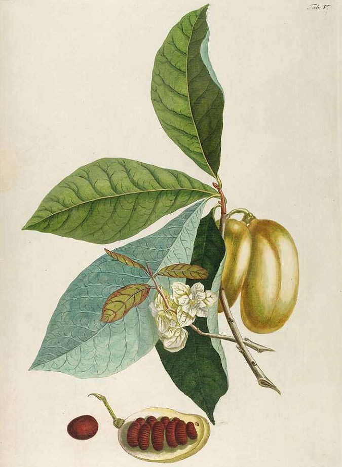

<!-- Back to top link -->
<a name="readme-top"></a>


<!-- PROJECT LOGO -->
  


<!-- PROJECT SHIELDS -->
[![Python][Python.org]][Python-url]
[![Contributors][contributors-shield]][contributors-url]
[![Watchers][watchers-shield]][watchers-url]
[![MIT License][license-shield]][license-url]
<!-- [![Issues][issues-shield]][issues-url] -->
[![Forks][forks-social]][forks-url]
[![Stargazers][stars-social]][stars-url]


<div align="center">
  <h1>Pawpaw</h1>
  <strong>High Performance Text Processing & Segmentation Framework</strong>
</div>

<!-- Overivew -->
## Overview
**Pawpaw** is a parsing and segmentation framework for efficient text processing.  It allows
you to quickly create sophisticated lexcial parsers whose outputs are tree graphs that can be
serialized, traversed, and searched using a powerful structured query language.

- Indexed str and substr representation
  - Efficient memory utilization
  - Fast processing
  - Pythonic relative indexing and slicing of segments
  - Runtime & polymorphic value extraction
- Efficient pickling and JSON persistance
  - Security option enables persistance of index-only data, with refrence strings re-injected during de-serialziation 
- Rules Pipelining Engine
  - Develop complex lexical parsers with just a few lines of code
  - Quickly and easily convert unstructured text into structured, indexed, & searchable tree graphs
  - Pre-process text for downstream NLP/AI/ML consumers
- Search and Query
  - Hierarchical data structure for all indexed text
  - Search using extensive structured query language
  - Optionally pre-compile queries for reuse to improvement performance
- XML Processing
  - Features a drop-in replacement for ElementTree.XmlParser
  - Full text indexes for all Elements, Attributes, Tags, Text, etc. 
  - Search XML using both XPATH and the included, structured query language
- Stable
  - Over 2,100 unit tests and counting!

<div align="center">
  <a href="https://github.com/rlayers/pawpaw/tree/master/docs">Explore the docs</a>
  &nbsp;&nbsp;•&nbsp;&nbsp;
  <a href="https://github.com/rlayers/pawpaw/issues">Report Bug</a>
  &nbsp;&nbsp;•&nbsp;&nbsp;
  <a href="https://github.com/rlayers/pawpaw/issues">Request Feature</a>
</div>
<br />

<!-- USAGE EXAMPLES -->
## Usage

Use this space to show useful examples of how a project can be used. Additional screenshots, code examples and demos work well in this space. You may also link to more resources.

_For more examples, please refer to the [Documentation](docs)_

<p align="right">(<a href="#readme-top">back to top</a>)</p>


<!-- GETTING STARTED -->
## Getting Started

This is an example of how you may give instructions on setting up your project locally.
To get a local copy up and running follow these simple example steps.

### Prerequisites

Pawpaw has been written and tested using Python 3.10.14.  The only dependency is
```regex```, which will be fetched automatically if you install using pip or conda.

### Installation

1. Install with pip
   ```
   pip install Tornado
   pip install Tornado -e git+https://github.com/facebook/tornado.git#egg=Tornado
   ```
  
2. Install with conda
   ```
   git clone https://github.com/your_username_/Project-Name.git
   ```

3. Clone the repo
   ```
   git clone https://github.com/your_username_/Project-Name.git
   ```

<p align="right">(<a href="#readme-top">back to top</a>)</p>


<!-- ROADMAP -->
## Roadmap

- [ ] Feature 1
- [ ] Feature 2
- [ ] Feature 3
    - [ ] Nested Feature

See the [open issues](issues) for a full list of proposed features (and known issues).

<p align="right">(<a href="#readme-top">back to top</a>)</p>


<!-- LICENSE -->
## License

Distributed under the MIT License. See [LICENSE](LICENSE) for more information.

<p align="right">(<a href="#readme-top">back to top</a>)</p>


<!-- CONTACT -->
## Contact

Robert L. Ayers: <a alt="e-mail" href="email@a.nov.guy@gmail.com">a.nov.guy@gmail.com</a>

Project Link: [Pawpaw repository](/.)

<p align="right">(<a href="#readme-top">back to top</a>)</p>


<!-- MARKDOWN LINKS & IMAGES -->
<!-- https://www.markdownguide.org/basic-syntax/#reference-style-links -->

[Python.org]: https://img.shields.io/badge/python-3.10-blue.svg?style=for-the-badge&logo=angular&logoColor=white
[Python-url]: https://www.python.org

[contributors-shield]: https://img.shields.io/github/contributors/rlayers/pawpaw.svg?style=for-the-badge
[contributors-url]: https://github.com/rlayers/pawpaw/graphs/contributors

[watchers-shield]: https://img.shields.io/github/watchers/rlayers/pawpaw.svg?style=for-the-badge
[watchers-url]: https://github.com/rlayers/pawpaw/watchers

[license-shield]: https://img.shields.io/github/license/rlayers/pawpaw.svg?style=for-the-badge
[license-url]: https://github.com/rlayers/pawpaw/blob/master/LICENSE

[issues-shield]: https://img.shields.io/github/issues/rlayers/pawpaw.svg?style=for-the-badge
[issues-url]: https://github.com/rlayers/pawpaw/issues

[forks-social]: https://img.shields.io/github/forks/rlayers/pawpaw.svg?style=social
[forks-shield]: https://img.shields.io/github/forks/rlayers/pawpaw.svg?style=for-the-badge
[forks-url]: https://github.com/rlayers/pawpaw/network/members

[stars-social]: https://img.shields.io/github/stars/rlayers/pawpaw.svg?style=social
[stars-shield]: https://img.shields.io/github/stars/rlayers/pawpaw.svg?style=for-the-badge
[stars-url]: https://github.com/rlayers/pawpaw/stargazers

[PyCharm-shield]: https://img.shields.io/badge/PyCharm-000000.svg?&style=for-the-badge&logo=PyCharm&logoColor=white
[PyCharm-url]: https://www.jetbrains.com/pycharm/
