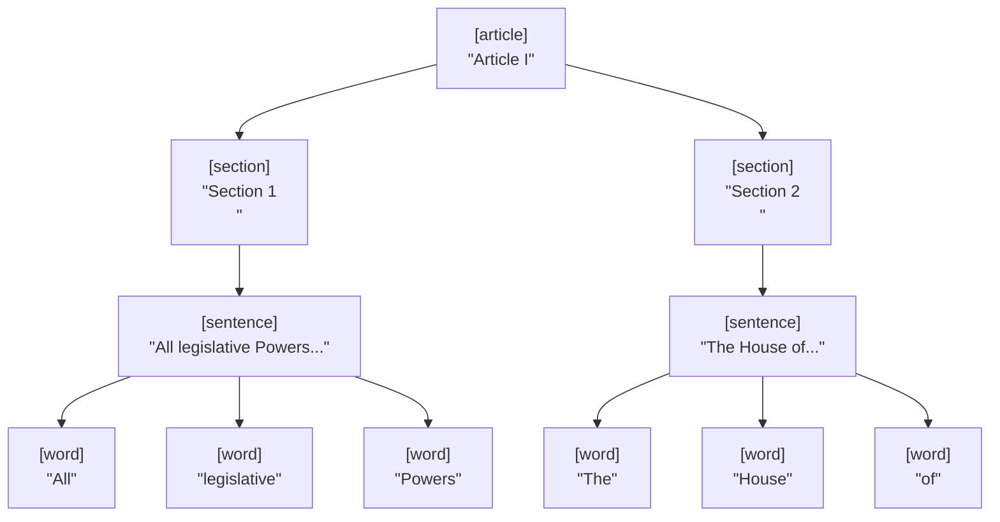

<!-- Back to top link -->
<a name="readme-top"></a>

<!-- PROJECT SHIELDS -->
[![Python][Python-shield]][Python-url]
[![Contributors][contributors-shield]][contributors-url]
[![Watchers][watchers-shield]][watchers-url]
[![Forks][forks-shield]][forks-url]
[![MIT License][license-shield]][license-url]
[![Stargazers][stars-social]][stars-url]
<br />

<!--  -->

<!-- 533E30  D2AC70  E4D1AE  517D3D  90C246 -->

# Pawpaw  [![High Performance Text Processing & Segmentation Framework][byline-img]][repo]

Pawpaw is a high performance text segmentation framework.  Segments are organized into tree graphs that can be serialized, traversed, and searched using a powerful structured query language.  Pawpaw also features a framework for quickly and easily building complex, pipelined parsers.

 

- Indexed str and substr representation
  - Efficient memory utilization
  - Fast processing
  - Pythonic relative indexing and slicing
  - Runtime & polymorphic value extraction
  - Tree graphs for all indexed text
- Search and Query
  - Search trees using plumule: a powerful structured query language similar to XPATH
  - Combined multiple axes, filters, and subqueries sequentially and recursively to any depth
  - Optionally pre-compile queries for increased performance
- Rules Pipelining Engine
  - Develop complex lexical parsers with just a few lines of code
  - Quickly and easily convert unstructured text into structured, indexed, & searchable tree graphs
  - Pre-process text for downstream NLP/AI/ML consumers
- XML Processing
  - Features a drop-in replacement for ElementTree.XmlParser
  - Full text indexes for all Elements, Attributes, Tags, Text, etc. 
  - Extract *both* ElementTree and Pawpaw datastructures in one go
    - The ElementTree and Pawpaw structures are cross-linked at each ELement
    - Search the resulting XML using both XPATH and Plumule
    - Access the raw XML corresponding to ElementTree elements, attributes, text, etc.
- NLP Support:
  - Pawpaw is ideal for both a) *preprocessing* unstructured text for downstream NLP consumption and b) *storing and searching* NLP generated content
  - Works with other libraries, such as [NLTK](https://www.nltk.org/)
- Efficient pickling and JSON persistance
  - Security option enables persistance of index-only data, with refrence strings re-injected during de-serialziation 
- Stable & Defect Free
  - Over 3,250 unit tests and counting!

<div align="center">
  <a href="https://github.com/rlayers/pawpaw/tree/master/docs">Explore the docs</a>
  &nbsp;&nbsp;•&nbsp;&nbsp;
  <a href="https://github.com/rlayers/pawpaw/issues">Request a feature or report a bug</a>
  &nbsp;&nbsp;•&nbsp;&nbsp;
  <a href="https://github.com/rlayers/pawpaw/tree/master/pawpaw">Explore the code</a>
</div>

<!-- EXAMPLE -->
## Example

With Pawpaw, you can take flat text that looks like this:

```
ARTICLE I
Section 1: Congress
All legislative Powers herein granted shall be vested in a Congress of the United States,
which shall consist of a Senate and House of Representatives.

Section 2: The House of Representatives
The House of Representatives shall be composed of Members chosen every second Year by the
People of the several States, and the Electors in each State shall have the Qualifications
requisite for Electors of the most numerous Branch of the State Legislature.
```

and quickly and easily builder a parser (or use your own) to produce a tree graph that look like this:



which can then search using a structured query statement like this:

 ```python
 '**[d:section]{**[d:word] & [lcs:citizen,court]}'  # All sections having either the word 'citizen' or 'court'
 ```

<!-- USAGE EXAMPLES -->
## Usage

Pawpaw has extensive features and capabilities you can read about in the [Docs](/Docs).  As a quick example, say you have some text that would like to perform nlp-like segmentation on. 

 ```python
 >>> s = 'nine 9 ten 10 eleven 11 TWELVE 12 thirteen 13'
 ```

You can use a regular expression for segmentation as follows:

 ```python
 >>> re = regex.compile(r'(?P<phrase>(?P<word>(?P<char>\w)+) (?P<number>(?P<digit>\d)+)\s*)+')
 ```
 
You can then use this regex to feed **Pawpaw**:

 ```python
 >>> doc = pawpaw.Ito.from_match(re.fullmatch(s))
 ```

With this single line of code, Pawpaw generates a fully hierarchical, tree of phrases, words, chars, numbers, and digits.  You can visualize the tree:

```python
>>> tree_vis = pawpaw.visualization.pepo.Tree()
>>> print(tree_vis.dumps(doc))
(0, 45) '0' : 'nine 9 ten 10 eleven 11 TWELVE 12 thir…
├──(0, 7) 'phrase' : 'nine 9 '
│  ├──(0, 4) 'word' : 'nine'
│  │  ├──(0, 1) 'char' : 'n'
│  │  ├──(1, 2) 'char' : 'i'
│  │  ├──(2, 3) 'char' : 'n'
│  │  └──(3, 4) 'char' : 'e'
│  └──(5, 6) 'number' : '9'
│     └──(5, 6) 'digit' : '9'
├──(7, 14) 'phrase' : 'ten 10 '
│  ├──(7, 10) 'word' : 'ten'
│  │  ├──(7, 8) 'char' : 't'
│  │  ├──(8, 9) 'char' : 'e'
│  │  └──(9, 10) 'char' : 'n'
│  └──(11, 13) 'number' : '10'
│     ├──(11, 12) 'digit' : '1'
│     └──(12, 13) 'digit' : '0'
├──(14, 24) 'phrase' : 'eleven 11 '
│  ├──(14, 20) 'word' : 'eleven'
│  │  ├──(14, 15) 'char' : 'e'
│  │  ├──(15, 16) 'char' : 'l'
│  │  ├──(16, 17) 'char' : 'e'
│  │  ├──(17, 18) 'char' : 'v'
│  │  ├──(18, 19) 'char' : 'e'
│  │  └──(19, 20) 'char' : 'n'
│  └──(21, 23) 'number' : '11'
│     ├──(21, 22) 'digit' : '1'
│     └──(22, 23) 'digit' : '1'
├──(24, 34) 'phrase' : 'TWELVE 12 '
│  ├──(24, 30) 'word' : 'TWELVE'
│  │  ├──(24, 25) 'char' : 'T'
│  │  ├──(25, 26) 'char' : 'W'
│  │  ├──(26, 27) 'char' : 'E'
│  │  ├──(27, 28) 'char' : 'L'
│  │  ├──(28, 29) 'char' : 'V'
│  │  └──(29, 30) 'char' : 'E'
│  └──(31, 33) 'number' : '12'
│     ├──(31, 32) 'digit' : '1'
│     └──(32, 33) 'digit' : '2'
└──(34, 45) 'phrase' : 'thirteen 13'
   ├──(34, 42) 'word' : 'thirteen'
   │  ├──(34, 35) 'char' : 't'
   │  ├──(35, 36) 'char' : 'h'
   │  ├──(36, 37) 'char' : 'i'
   │  ├──(37, 38) 'char' : 'r'
   │  ├──(38, 39) 'char' : 't'
   │  ├──(39, 40) 'char' : 'e'
   │  ├──(40, 41) 'char' : 'e'
   │  └──(41, 42) 'char' : 'n'
   └──(43, 45) 'number' : '13'
      ├──(43, 44) 'digit' : '1'
      └──(44, 45) 'digit' : '3'
```
 
And you can search the tree using Pawpaw's *plumule*, a powerful XPATH-like structured query language:

 ```python
 >>> print(*doc.find_all('**[d:dig]'), sep=', ')  # all digits
9, 1, 0, 1, 1, 1, 2, 1, 3
 >>> print(*doc.find_all('**[d:num]{</*[s:i]}'), sep=', ')  # all numbers with 'i' in their name
9, 13
 ```

This example uses regular expressions as a source, however, Pawpaw is able to work with many other input types.  For example, you can use libraries such as [NLTK](https://www.nltk.org/) to grow Pawpaw trees, or, you can use Pawpaw's included parser framework to build your own sophisticated parsers quickly and easily.

<p align="right">(<a href="#readme-top">back to top</a>)</p>

<!-- GETTING STARTED -->
## Getting Started

### Prerequisites

Pawpaw has been written and tested using Python 3.10.  The only dependency is
``regex``, which will be fetched and installed automatically if you install Pawpaw
with pip or conda.

### Installation Options

There are lots of ways to install Pawpaw:

1. Install with pip from PyPI:  
   ```
   pip install pawpaw
   ```
   
2. Install with pip from GitHub:
   ```
   pip install git+https://github.com/rlayers/pawpaw.git
   ```

3. Install with conda from PyPI:
   ```
   conda activate myenv
   conda install git pip
   pip install pawpaw
   ```

4. Install with conda from GitHub:
   ```
   conda activate myenv
   conda install git pip
   pip install git+https://github.com/rlayers/pawpaw.git
   ```

5. Clone the repo with git from GitHub:
   ```
   git clone https://github.com/rlayers/pawpaw
   ```
   
### Verify

Open a python prompt and type:

  ```python
  >>> from pawpaw import Ito
  >>> Ito('Hello, World!')
  Ito('Hello, World!', 0, 13, None)
  ```
  
If your last line looks like this, you are up and running with Pawpaw!

<p align="right">(<a href="#readme-top">back to top</a>)</p>


<!-- HISTORY & ROADMAP -->
## History & Roadmap

Pawpaw is a rewrite of *desponia*, a now-deprecated Python 2.x segmentation framework that was itself based on a prior framework called *Ito*.  Currently in alpha, many components and features are production ready.  However, documentation is still being written and some newer features are still undergoing work.  A rough outline of what components are production ready is as follows

- [x] arborform
- [x] core (Span & Ito)
  - [x] itorator
  - [x] postorator
- [ ] documentation & examples
- [x] query
  - [x] radicle query engine
  - [x] plumule
- [ ] NLP
- [ ] visualization
  - [ ] ascibox
  - [x] highlighter
  - [ ] pepo
  - [x] sgr
- [ ] xml
  - [ ] XmlHelper
  - [x] XmlParser

<p align="right">(<a href="#readme-top">back to top</a>)</p>
-->


<!-- CONTRIBUTING -->
## Contributing

Contributions to Pawpaw are **greatly appreciated** - please refer to the [contributing guildelines](/contributing.md) for details.

<p align="right">(<a href="#readme-top">back to top</a>)</p>


<!-- LICENSE -->
## License

Distributed under the MIT License. See [LICENSE](LICENSE) for more information.

<p align="right">(<a href="#readme-top">back to top</a>)</p>


<!-- CONTACTS -->
## Contacts

Robert L. Ayers:&nbsp;&nbsp;<a alt="e-mail" href="email@a.nov.guy@gmail.com">a.nov.guy@gmail.com</a>
<!-- &nbsp;&nbsp;&nbsp;[☕ Buy me a coffee](https://ko-fi.com/jlawrence) -->

<p align="right">(<a href="#readme-top">back to top</a>)</p>


<!-- REFERENCES -->
## References

* [Matthew Barnett's regex](https://github.com/mrabarnett/mrab-regex)
* [NLTK](https://www.nltk.org/)

<p align="right">(<a href="#readme-top">back to top</a>)</p>


<!-- MARKDOWN LINKS & IMAGES -->
<!-- https://www.markdownguide.org/basic-syntax/#reference-style-links -->

<!-- Palette Info:
  "Oriental Beauty"
  533E30	D2AC70	E4D1AE	517D3D	90C246
  https://www.schemecolor.com/oriental-beauty-color-combination.php
-->

[repo]: https://github.com/rlayers/pawpaw

[byline-img]: https://img.shields.io/badge/-High%20Performance%20Text%20Segmentation%20Framework-FFFFFF

[byline2-img]: https://readme-typing-svg.demolab.com?font=Fira+Code&weight=800&duration=500&pause=1500&color=533E30&vCenter=true&width=375&height=25&lines=High+Performance+Text+Segmentation

[Python-shield]: https://img.shields.io/badge/python-≥3.10-517D3D.svg?style=flat
[Python-url]: https://www.python.org

[contributors-shield]: https://img.shields.io/github/contributors/rlayers/pawpaw.svg?color=90C246&style=flat
[contributors-url]: https://github.com/rlayers/pawpaw/graphs/contributors

[watchers-shield]: https://img.shields.io/github/watchers/rlayers/pawpaw.svg?color=E4D1AE&style=flat
[watchers-url]: https://github.com/rlayers/pawpaw/watchers

[issues-shield]: https://img.shields.io/github/issues/rlayers/pawpaw.svg?style=flat
[issues-url]: https://github.com/rlayers/pawpaw/issues

[forks-social]: https://img.shields.io/github/forks/rlayers/pawpaw.svg?style=social
[forks-shield]: https://img.shields.io/github/forks/rlayers/pawpaw.svg?color=D2AC70&style=flat
[forks-url]: https://github.com/rlayers/pawpaw/network/members

[license-shield]: https://img.shields.io/github/license/rlayers/pawpaw.svg?color=533E30&style=flat
[license-url]: https://github.com/rlayers/pawpaw/blob/master/LICENSE

[stars-social]: https://img.shields.io/github/stars/rlayers/pawpaw.svg?style=social
[stars-shield]: https://img.shields.io/github/stars/rlayers/pawpaw.svg?style=flat
[stars-url]: https://github.com/rlayers/pawpaw/stargazers

[PyCharm-shield]: https://img.shields.io/badge/PyCharm-000000.svg?&style=flat&logo=PyCharm&logoColor=white
[PyCharm-url]: https://www.jetbrains.com/pycharm/
