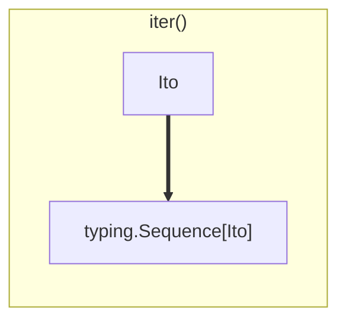
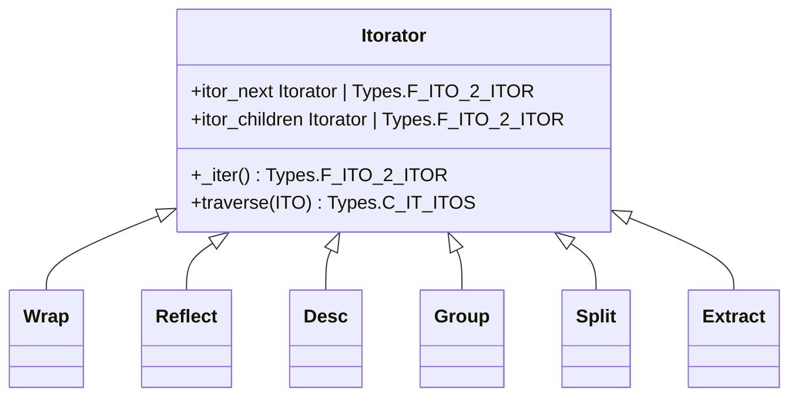

# Arborform

## Introduction

Pawpaw supports the rapid creation of complex text parsers using the arborform module.  Arborform consists of two class hierarchies:

``Itorator``[^itorator_name]: Generator-based pipelined ``Ito`` creation 
``Postorator``: Pipelined ``Ito`` sequence consolidation

## The Pipeline

Pawpaw's arborform supports rapid parser creation using a divide and conquer strategy composed of discrete, pipelined steps.  Steps are peformed by ``Itorator`` instances, which operate on an ``Ito`` sequence.  An ``Itorator``, at the most basic level, takes an ``Ito`` and transforms into a new ``Ito`` *sequence*:

Itorator's are chained together via the ``itor_next`` and ``itor_children`` properties.  For each incoming ``Ito``, an ``Itorator``:

1. Performs the transformation ``Ito`` → ``typing.Sequence[Ito]``
2. Passes each resulting ``Ito`` to:
   1. ``itor_children`` (if any)
      - *Results are appended to the input ``Ito``*
   2. ``itor_next``
      - *Results are returned instead of the input ``Ito``*
3. If ``itor_next`` is ``None``, the transformed ``Ito`` sequence is simply returned
   
## Topology

[^itorator_name]: The name "Itorator" comes from a portmanteau of "Ito" and "Iterator"
