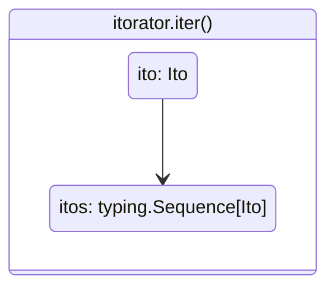
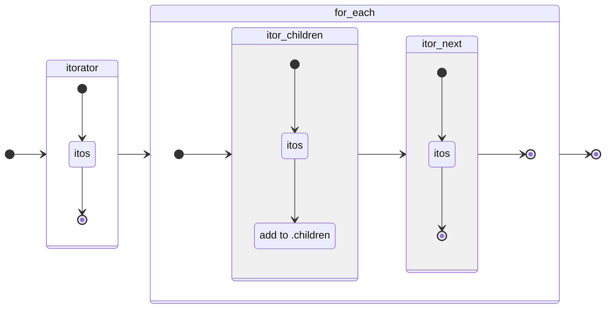
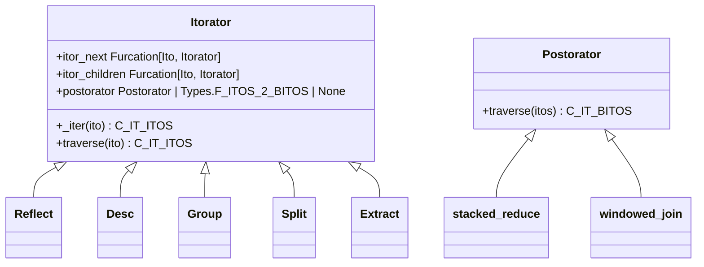

# Arborform

## Introduction

Pawpaw supports the rapid creation of complex text parsers using the arborform module.  Arborform consists of two class hierarchies:

``Itorator``[^itorator_name]: Generator-based pipelined ``Ito`` creation 
``Postorator``: Pipelined ``Ito`` sequence consolidation

## The Pipeline

Pawpaw's arborform supports rapid parser creation using a divide and conquer strategy composed of discrete, pipelined steps.  Steps are peformed by ``Itorator`` instances, which operate on an ``Ito`` sequence.  An ``Itorator``, at the most basic level, takes an ``Ito`` and transforms it into an ``Ito`` *sequence* via its ``.iter``: method



The  ``.traverse`` method serves as a pipeline starting point, taking a single ``Ito`` as input:

```python
>>> from pawpaw import Ito, arborform
>>> s = 'The quick brown fox'
>>> i = Ito(s)
>>> split_words = arborform.Itorator.wrap(lambda ito: ito.str_split())  # perform str.split
>>> for result in split_words.traverse(i):
>>>   print(result)
The
quick
brown
fox
```

``Itorator`` objects are chained together via the ``.itor_next`` and ``.itor_children`` properties.  For unconditional chaining, just set either of these properties to the ``Itorator`` objects you wish to link to.  More complex chaining approaches are also possible - see the [Advanced Chaining](#advanced-chaining) section below for more details.)

### ``itor_next``

The ``.itor_next`` property is used to feed an ``Ito`` sequence from one ``Itorator`` to another as a *lateral* flow.  I.e., each ``Ito`` in the sequence is passed to an ``Itorator`` which then **transforms** it via its ``.iter`` method.  For example, an ``Itorator`` that performs a word split can pass its output to another ``Itorator`` that performs a char split.  The overall output will consist of char ``Ito`` objects:

```python
>>> from pawpaw import Ito, arborform
>>> s = 'The quick brown fox'
>>> i = Ito(s)
>>> split_words = arborform.Itorator.wrap(lambda ito: ito.str_split())
>>> split_chars = arborform.Itorator.wrap(lambda ito: [*ito])  # convert to 1-char long Itos
>>> split_words.itor_next = split_chars
>>> for result in split_words.traverse(i):
>>>   print(result)
T
h
e
q
u
i
c
k
b
r
o
w
n
f
o
x
```

### ``itor_children``

The ``.itor_children`` property is used to feed an ``Ito`` sequence from one ``Itorator`` to another as a *downward* flow.  I.e., each ``Ito`` in the sequence is passed to an ``Itorator``, whose ``.iter`` method result is then added to the ito's ``.children``.  For example, an ``Itorator`` that performs a word split can pass its output to another ``Itorator`` that performs a char split.  The overall output will consist of *trees* whose roots are words and leaves are chars:

```python
>>> from pawpaw import Ito, arborform, visualization
>>> s = 'The quick brown fox'
>>> i = Ito(s)
>>> split_words = arborform.Itorator.wrap(lambda ito: ito.str_split())
>>> split_chars = arborform.Itorator.wrap(lambda ito: [*ito])  # convert to 1-char long Itos
>>> split_words.itor_children = split_chars
>>> tree_vis = pawpaw.visualization.pepo.Tree()
>>> for result in split_words.traverse(i):
>>>   print(tree_vis.dumps(result))
(0, 3) 'None' : 'The'
├──(0, 1) 'None' : 'T'
├──(1, 2) 'None' : 'h'
└──(2, 3) 'None' : 'e'

(4, 9) 'None' : 'quick'
├──(4, 5) 'None' : 'q'
├──(5, 6) 'None' : 'u'
├──(6, 7) 'None' : 'i'
├──(7, 8) 'None' : 'c'
└──(8, 9) 'None' : 'k'

(10, 15) 'None' : 'brown'
├──(10, 11) 'None' : 'b'
├──(11, 12) 'None' : 'r'
├──(12, 13) 'None' : 'o'
├──(13, 14) 'None' : 'w'
└──(14, 15) 'None' : 'n'

(16, 19) 'None' : 'fox'
├──(16, 17) 'None' : 'f'
├──(17, 18) 'None' : 'o'
└──(18, 29) 'None' : 'x'
```

### ``Pipeline Topology``

It's perfectly valid to set both the ``.itor_next`` and ``.itor_children`` properties for an ``Itorator``.  The ``.itor_children`` is evaluated *prior to* the ``.itor_next``, as shown in the following visualization:


   
## Parsing Strategy

If you have written complex text parsers before, you might have noticed a pattern in these projects.  Your initial, first-attempt parsers seem to almost write themselves.  Things are going great!  But as you continue to implmeent more and more rules, your code base starts to become large and unweildy.  Small changes to one part have unintended consequences for other parts, and fixing a problem for one file often causes problems with another.

A good strategy for avoiding these scenarios it to utilize a divide-and-conquer approach to your parsing approaches.  This strategy is baked into the Pawpaw achitcture, whereby each pipelined ``Itorator`` encapsulates a concrete step, the status of which can be inspected and/or tested.  Successul use of this strategy means keeping your ``Itorator`` steps "small".  For example, large complex regular expressions are not only difficult to write, but equally hard to test, diagnose, and change.  Breaking apart the regular expression into more fine-grained tasks via itorator not only results in easier patterns, but also helps to de-couple the various operations in a way that reduces unintended cause and effect.

## Advanced Chaining

Internally, the ``itor_next`` and ``itor_children`` are each a specialized list of *monad-like* predicate-value pairs.  These pairs are modeled in Pawpaw as the class ``PredicatedValue``.  The predicates are python callable objects that input an ``Ito`` and return a ``bool``.  The values are either an ``Itorator`` or ``None``.

The specialized list of ``PredicatedValue`` is modeled in Pawpaw as class ``Furcation``[^furcation].  Evaluation of a ``Furcation`` involves taking a given ``Ito`` and evaluating each predicate in sequential order until a value of ``True`` is obtained, at which point the associated value is returned.  If no predicates return ``True``, then the ``Furcation`` returns ``None``.

The furcation-based architecture has two key advantages:

* Better run-time type checks, 
* Pipeline visualization

The most frequent pipeline connections are a) unconditional flow to a single ``Itorator`` and b) conditional flow to a single ``Itorator`` (otherwise None.)  The ``itor_next`` and ``itor_children` properties are highly overloaded, and directly support these two connection types using simple syntax as follows:

1. Property set to a ``Itorator``: Furcation contains a single ``PredicatedValue`` whose predice is a tautology[^tautology], and whose value is the ``Itorator``.
   * Flow will always proceed to the indicated ``Itorator``
2. Property set to a tuple containing a callable and itorator: Furcation contains a single ``PredicatedValue`` whose predice is the callable, and whose value is the ``Itorator``.
   * Flow will proceed to the indicated ``Itorator`` when the callable returns True, otherwise the pipeline ends.
4. Property set to a ``PredicatedValue``: Furcation contains the ``PredicatedValue`` only.
   * Flow will always proceed to the .value of the ``PredicatedValue`` of the .predicate returns True, otherwise the pipeline ends.

Example:

```python
>>> from pawpaw import arborform
>>> itor_ltrim_one = arborform.Itorator.wrap(lambda ito: Ito(ito, 1, desc=ito.desc))
>>> itor_ltrim_one.itor_next  # Furcation empty
[]
>>> itor_rtrim_one = arborform.Itorator.wrap(lambda ito: Ito(ito, stop=-1, desc=ito.desc))
>>> itor_ltrim_one.itor_next = itor_rtrim_one
>>> itor_ltrim_one.itor_next  # Furcation has single item
[<pawpaw._predicated_value.PredicatedValue object at 0x0000029249101BA0>]
>>> itor_ltrim_one.itor_next[0].predicate
<bound method Furcation.tautology of <class 'pawpaw._furcation.Furcation'>>
>>> itor_ltrim_one.itor_next[0].value
<pawpaw.arborform.itorator.itorator._WrappedItorator object at 0x000002924872AF80>
```

For more complex, multi-predicate control flows, simply use the standard list ``.append``, ``.insert``, etc. methods of the ``Furcation`` object.  These methods are also overloaded, allowing you to pass either:

1. a ``PredicatedValue``: item is used as is
2. a predicate: a ``PredicatedValue`` is created for the given predicate, with a value of ``None``
3. an itorator: a ``PredicatedValue`` is created with a predicate set to a tautology function, and value set to the given itorator
4. a predicate-itorator tuple: a ``PredicatedValue`` is created for the given predicate and itorator

Example:

```python
>>> from pawpaw import arborform
>>> itor_ltrim_one = arborform.Itorator.wrap(lambda ito: Ito(ito, 1, desc=ito.desc))
>>> itor_rtrim_one = arborform.Itorator.wrap(lambda ito: Ito(ito, stop=-1, desc=ito.desc))
>>> itor_split = arborform.Itorator.wrap(lambda ito: ito.str_split())
>>> itor_ltrim_one.itor_next = (lamdba ito: ito.str_endswith(' '), itor_rtrim_one)
>>> itor_ltrim_one.itor_next.append((lamdba ito: len(ito) > 0, itor_split))
>>> itor_ltrim_one.itor_next  # Furcation has two items
[<pawpaw._predicated_value.PredicatedValue object at 0x0000029249101BA0>, <pawpaw._predicated_value.PredicatedValue object at 0x00000292431D090>]
```

## Class Hierarchy



[^itorator_name]: The name "Itorator" comes from a portmanteau of "Ito" and "Iterator"

[^predicate]: A function that returns a Boolean value.

[^furcation]: A "Furcation" is the act or process offorking or branching out, e.g., bifurcation, trifurcation, etc.

[^tautology]: A function that always returns True.

[^previous_chaining]: In earlier versions, these properties were ``Callable`` objects, which had signatures that took an ``Ito`` object and which returned either an ``Itorator`` or ``None``.  This had the advantage of allowing you to use an arbitrary lambda to resolve the the next itorator.  However, this makes it difficult to perform type checking during parser construction, and there was no way to model the overall pipeline for visualization, debugging, or diagnostic purposes.
