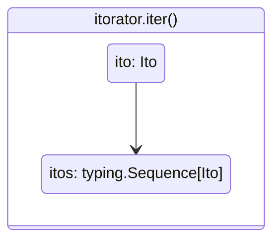
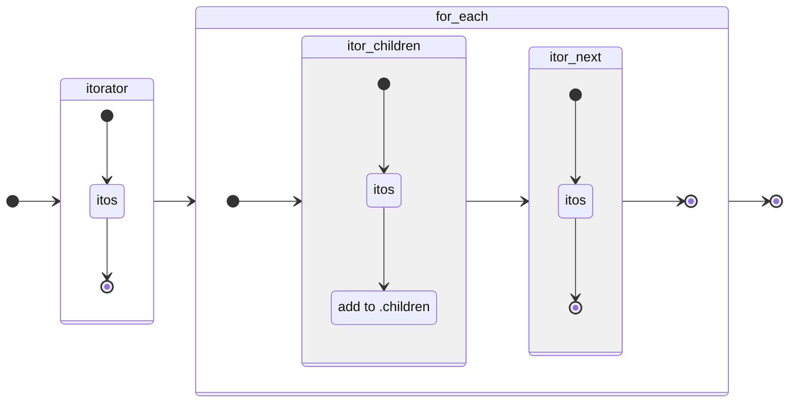
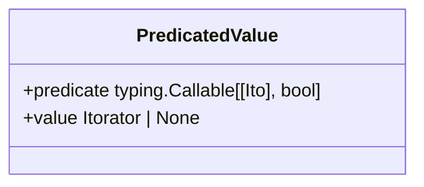
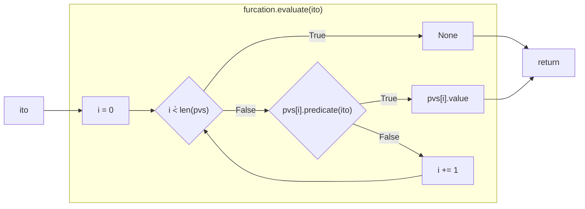
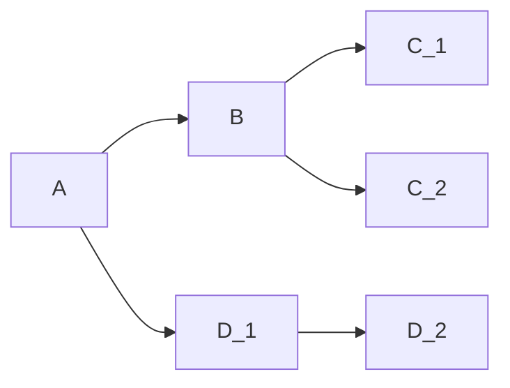
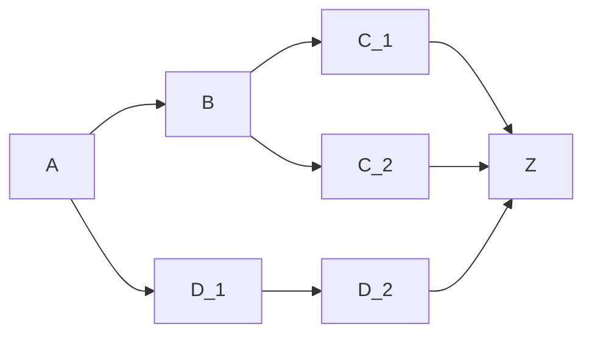
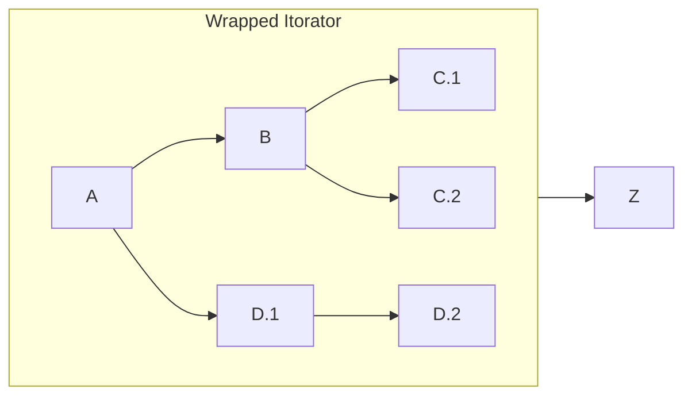
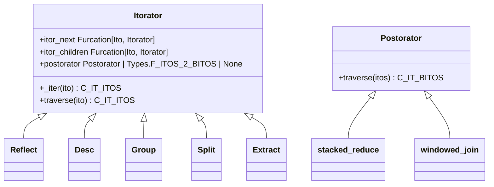

# Arborform

## Introduction

Pawpaw supports the rapid creation of complex text parsers using the arborform module.  Arborform consists of two class hierarchies:

``Itorator``[^itorator_name]: Generator-based pipelined ``Ito`` creation 
``Postorator``: Pipelined ``Ito`` sequence consolidation

## The Pipeline

Pawpaw's arborform supports rapid parser creation using a divide and conquer strategy composed of discrete, pipelined steps.  Steps are peformed by ``Itorator`` instances, which operate on an ``Ito`` sequence.  An ``Itorator``, at the most basic level, takes an ``Ito`` and transforms it into an ``Ito`` *sequence* via its ``.iter``: method



The  ``.traverse`` method serves as a pipeline starting point, taking a single ``Ito`` as input:

```python
>>> from pawpaw import Ito, arborform
>>> s = 'The quick brown fox'
>>> i = Ito(s)
>>> split_words = arborform.Itorator.wrap(lambda ito: ito.str_split())  # perform str.split
>>> for result in split_words.traverse(i):
>>>   print(result)
The
quick
brown
fox
```

``Itorator`` objects are chained together via the ``.itor_next`` and ``.itor_children`` properties.  For unconditional chaining, just set either of these properties to the ``Itorator`` objects you wish to link to.  More complex chaining approaches are also possible - see the [Advanced Chaining](#advanced-chaining) section below for more details.)

### ``itor_next``

The ``.itor_next`` property is used to feed an ``Ito`` sequence from one ``Itorator`` to another as a *lateral* flow.  I.e., each ``Ito`` in the sequence is passed to an ``Itorator`` which then **transforms** it via its ``.iter`` method.  For example, an ``Itorator`` that performs a word split can pass its output to another ``Itorator`` that performs a char split.  The overall output will consist of char ``Ito`` objects:

```python
>>> from pawpaw import Ito, arborform, visualization
>>> s = 'Hello, world!'
>>> i = Ito(s)
>>> split_reflect = arborform.Reflect()  # Reflects current ito (no transformation)
>>> vis_compact = visualization.pepo.Compact()
>>> for result in split_words.traverse(i):
>>>   print(vis_compact.dumps(r)
1: (0, 13) 'None' : 'Hello, world!'
>>>
>>> itor_desc = arborform.Desc(lambda ito: 'Changed')  # Changes descriptor
>>> itor_reflect.itor_next = itor_desc
>>> for result in split_words.traverse(i):
>>>   print(vis_compact.dumps(r)
1: (0, 13) 'Changed' : 'Hello, world!'
```

### ``itor_children``

The ``.itor_children`` property is used to feed an ``Ito`` sequence from one ``Itorator`` to another as a *downward* flow.  I.e., each ``Ito`` in the sequence is passed to an ``Itorator``, whose ``.iter`` method result is then added to the ito's ``.children``.  For example, an ``Itorator`` that performs a word split can pass its output to another ``Itorator`` that performs a char split.  The overall output will consist of *trees* whose roots are words and leaves are chars:

```python
>>> from pawpaw import Ito, arborform, visualization
>>> s = 'Hello, world!'
>>> i = Ito(s)
>>> split_words = arborform.Itorator.wrap(lambda ito: ito.str_split())  # str split
>>> split_chars = arborform.Itorator.wrap(lambda ito: [*ito])  # extract char itos
>>> split_words.itor_children = split_chars
>>> tree_vis = pawpaw.visualization.pepo.Tree()
>>> for result in split_words.traverse(i):
>>>   print(tree_vis.dumps(result))
(0, 6) 'None' : 'Hello,'
├──(0, 1) 'None' : 'H'
├──(1, 2) 'None' : 'e'
├──(2, 3) 'None' : 'l'
├──(3, 4) 'None' : 'l'
├──(4, 5) 'None' : 'o'
└──(5, 6) 'None' : ','

(7, 13) 'None' : 'world!'
├──(7, 8) 'None' : 'w'
├──(8, 9) 'None' : 'o'
├──(9, 10) 'None' : 'r'
├──(10, 11) 'None' : 'l'
├──(11, 12) 'None' : 'd'
└──(12, 13) 'None' : '!'
```

### ``Pipeline Topology``

It's perfectly valid to set both the ``.itor_next`` and ``.itor_children`` properties for an ``Itorator``.  The ``.itor_children`` is evaluated *prior to* the ``.itor_next``, as shown in the following visualization:


   
## Parsing Strategy

If you have written complex text parsers before, you might have noticed a pattern in these projects.  Your initial, first-attempt parsers seem to almost write themselves.  Things are going great!  But as you continue to implmeent more and more rules, your code base starts to become large and unweildy.  Small changes to one part have unintended consequences for other parts, and fixing a problem for one file often causes problems with another.

A good strategy for avoiding these scenarios it to utilize a divide-and-conquer approach to your parsing approaches.  This strategy is baked into the Pawpaw achitcture, whereby each pipelined ``Itorator`` encapsulates a concrete step, the status of which can be inspected and/or tested.  Successul use of this strategy means keeping your ``Itorator`` steps "small".  For example, large complex regular expressions are not only difficult to write, but equally hard to test, diagnose, and change.  Breaking apart the regular expression into more fine-grained tasks via itorator not only results in easier patterns, but also helps to de-couple the various operations in a way that reduces unintended cause and effect.

## Advanced Chaining

### Simple Pipeline Conections

The most frequent pipeline connections are a) unconditional flow to a single ``Itorator`` and b) conditional flow to a single ``Itorator`` (otherwise None.)  The ``.itor_next`` and ``.itor_children` properties are highly overloaded, and directly support setting these two connection types:

```python
>>> itor_1.itor_next = itor_2  # unconditional lateral flow (itor_1 → itor_2)
>>> itor_1.itor_child = lambda ito: ito.desc = 'parent', itor_3  # conditional downward flow (itor_1 ↓ itor_2)
```

### Chaining Internals

Internally, the ``.itor_next`` and ``.itor_children`` properties have overloaded setters that support this type of varied syntax.  The underlying data for both of these is a specialized list of *monad-like* predicate-value pairs.  Each pair is modeled in Pawpaw as the class ``PredicatedValue``.  Predicates are Python callable objects with a single parameter, ``Ito``, and which return a ``bool``.  Values are either an ``Itorator`` or ``None``.



The specialized list of ``PredicatedValue`` is modeled in Pawpaw as class ``Furcation``[^furcation_name].  Evaluation of a ``Furcation`` for a given ``Ito`` is done by evaluating each predicate in sequential order until a value of ``True`` is obtained, at which point the associated value (an ``Itorator`` or ``None``) is returned.  If no predicate returns ``True``, then ``None`` is returned.



Although complex, this furcation-based architecture has several key advantages:

* Better run-time type checks
* Pipeline visualization

The ``.itor_next`` and ``.itor_children` properties setters actually perform a transformation based on the value type passed, and initialize the furcation list with the result:

| Value Type | Transformation | len(Furcation) |
|:----------:|:--------------:|:---------------:|
| None | N/A | 0 |
| Itorator | PredicateValue(Furcation.tautology, value) | 1 |
| tuple(Predicate, Itorator) | PredicateValue(value[0], value[1]) | 1 |
| Predicate | PredicateValue(value, None) | 1 |
| PredicateValue | value | 1 |

Note that ``PredicateValue`` with a ``.value`` of None is perfectly valid.  When only an itorator is passed, a placeholder predicate, ``Furcation.tautology``, is used[^tautology].  In such a case, the furcation evaluation always returns the given ``Itorator``.

For more complex, multi-predicate control flows, simply use standard list accessors methods (e.g. ``.append``, ``.extend``, ``.insert``, etc.) of the ``Furcation`` object.  These methods are also overloaded, allowing you to pass either:

1. ``Predicate``
2. ``Itorator``
3. ``tuple[Predicate, Itorator]``
4. ``PredicatedValue``

Example:

```python
>>> itor_1.itor_next = itor_2  # init
>>> itor_1.itor_next.append((func_1, itor_3)) # append tuple
>>> itor_1.itor_next.append(func_2) # append predicate
>>> itor_1.itor_next.append(itor_4) # append itorator
```

### Aggregation

Complex connections will result in an ``Itorator`` having *multiple* flow paths.  For example:


If this is your entire pipeline, then calling ``.traverse`` on A yield the output of either C_1, C_2, or D_2, as expected, and nothing more need be done.

Alternatively, sometimes you'll need to *merge* flow paths.  For example, you might need a final processing step, Z, be performed on all three paths:



You can do this by adding Z to each of the three itorators' ``.itor_next`` furcations:

```python
>>> A.itor_next = F1, B
>>> A.itor_next.append(D_1)
>>> B.itor_next = F2, C_1
>>> B.itor_next.append(C_2)
>>> D_1.itor_next = D_2
>>> # Merge all three branches
>>> C_1.itor_next = Z
>>> C_2.itor_next = Z
>>> D_2.itor_next = Z
```

Although valid, this approach can problematic for complex pipelines.  As you develop your pipelines, and paths are being added, altered, and deleted, you will need to be vigalent about removing and re-adding the final merge step for all affected branches.  More than likely, you will overlook one and your pipeline will be incorrect.

Alternatively, you can manage these complex chains using the ``Itorator.wrap()`` constructor to create an aggregated, *sub-pipeline* having a **single output**:



The code for this is as follows:

```python
>>> A.itor_next = F1, B
>>> A.itor_next.append(D_1)
>>> B.itor_next = F2, C_1
>>> B.itor_next.append(C_2)
>>> D_1.itor_next = D_2
>>> # Wrap A
>>> wrapped = Itorator.wrap(lambda ito: A.traverse)
>>> wrapped.itor_next = Z
```

Creating a wrapped ``Itorator`` results in a single end-point to which you can connect to.  As you revise the sub-pipeline, the final merged connection is unaffected, and you are reliveved from having to manage the merge code for each and every sub-path:

```python
>>> A.itor_next = F1, B
>>> A.itor_next.append(D_1)
>>> B.itor_next = F2, C_1
>>> B.itor_next.append(C_2)
>>> C_2.itor_next = C_3  # new node
>>> D_1.itor_next = D_2
>>> # Wrap
>>> wrapped = Itorator.wrap(lambda ito: A.traverse)
>>> wrapped.itor_next = Z  # correctly merged
```

## Class Hierarchy



[^itorator_name]: The name "Itorator" comes from a portmanteau of "Ito" and "Iterator"

[^predicate]: A function that returns a Boolean value.

[^furcation_name]: A "Furcation" is the act or process offorking or branching out, e.g., bifurcation, trifurcation, etc.

[^tautology]: A function that always returns True.
