# Arborform

## Introduction

### Common Parser Development Issues

If you've previously written complex text parsers you might have noticed a pattern in how they progress.  Your initial, first-attempt parsers seem to almost write themselves.  Things are going great!  But as you continue to implement more and more rules, your code starts to become unweildy.  Small changes to one one rule result in unintended consequences elsewhere, and it becomes difficult to visualize and/or understand state at various points in the programs' flows.

### Pipelining

Pawpaw's arborform framework makes it easier to develop large, complex parsers using a *pipeline* approach.  In a pipeline, each task is encapsulated, with results received from, and feeding into, another.  This not only simplifies task implementation, it also makes it easier to keep track of state, which helps with managing unintended side-effects.

### Example

For example, NLP processing typically comprises multiple smaller tasks.  A typically scneario might involve processing a segment by performing these three actions:

1. Split paragraphs
2. Split sentences
3. Split words

It might be possible to perform all of these tasks using a single regular expression:

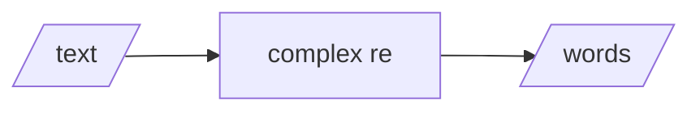
Although feasible, NLP boundary detection tasks are non-trivial.  A singular regular expression will quickly become unweildy in the pursuit of reasonable precision and accuracy.

An alternative technique involves isolating each task in a pipeline:
  
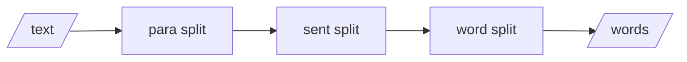

This technique offers many advantages:

1. Unexpected-side effects are minimized
2. Tasks can be polymorphic, with run-time delegation 
3. Additional tasks can be easily inserted as needed

The arborform framework is designed around pipelined parser framework development.  Individual tasks are expressed as ``Itorator`` objects, which can be connected together in both top-down and lateral pipelines:

#### Top Down

```python
>>> from pawpaw.arborform import Connectors
>>> itor_para, itor_sent, itor_word = ...
>>> itor_para.connections.append(Connectors.Recurse(itor_sent))
>>> itor_para.connections.append(Connectors.Recurse(itor_word))
```

#### Lateral

```python
>>> from pawpaw.arborform import Connectors
>>> itor_para, itor_sent, itor_word = ...
>>> itor_para.connections.append(Connectors.Recurse(itor_sent))
>>> itor_sent.connections.append(Connectors.Recurse(itor_word))
```

Pipelines can incorporate *both* top-down and lateral flows, and connections can be predicate-based (for conditional branching), as well as support parent-to-child relationships.  

Pipeline implementation in arborform makes extensive use of the the Python generator/iterator[^python_iter_gen] idiom, and achieve a reasonable mixture of performance and memory conservation.  The resulting architecture is highly flexible and scalable.  The key classes in arborform are:

* ``Itorator``[^itorator_name]: Generator-based ``Ito`` transformation
* ``Connector``: Defines connection type between itorators
* ``Postorator``: Generator-based ``Iterable[Ito]`` consolidation

## Itorator

The ``Itorator`` class encapsulates a single *transformation* step in a parser pipeline, whereby a given ``Ito`` is transformed into zero, one, or more itos, represented by a ``typing.Iterable[Ito]``.  Some examples of transformations include:

* Use ``.str_strip`` to get a shortened ito
* Split an ito into multiple itos
* Exclude (i.e. filter) an ito from the final output

Itorators are callable objects[^callable_object] are are invoked using simple function syntax.  The single input parameter is an ``Ito``, and the return type is a generator, which you can iterate over, unpack into a container, etc:

```python
>>> from pawpaw import Ito, arborform
>>> s = 'Hello, world!'
>>> i = Ito(s)
>>> i  # Starting ito has no .desc
Ito(span=(0, 13), desc='', substr='Hello, world!')
>>> itor_desc = arborform.Desc('changed')  # Desc itorator: changes .desc property
>>> next(itor_desc(i))  # Invoke itorator and get first item from pipeline
Ito(span=(0, 13), desc='changed', substr='Hello, world!')
```

When invoked, an itorator clones the input Ito, which guarrantees that it is unaltered by the pipeline:

```python
>>> i  # Original remains unmodified
Ito(span=(0, 13), desc='', substr='Hello, world!')
```

Transformations are performed in the ``._transform`` method, which is abstract for the base class ``Itorator``.  The ``._transform`` method is not intended to be called directly, rather, it is available for you to override in derived classes.  Several concrete itorators with implementations for ``._transform`` are available:

| Concrete Class | Description                                                             |
|:---------------|:------------------------------------------------------------------------|
| ``Reflect``    | Yields an unaltered ito                                                 |
| ``Filter``     | Conditionally reflects an ito                                           |
| ``Desc``       | Alters the ``.desc`` for an ito and yields it                           |
| ``ValueFunc``  | Alters the ``.value_func`` for an ito and yields it                     |
| ``Split``      | Splits an ito and yields the results                                    |
| ``Extract``    | Builds an ito hierarchy from a regex and yields it                      |
| ``Nuco``       | Sequentially evaluates itorators, yielding the first non-empty results  |
| ``Invert``     | Given an ito and itorator, yields the non-matching spans                |

The arborform module also supports dynamically defining ``._transform`` behavior via the ``Itorator.wrap`` method.  This method creates a *wrapped, concrete itorator* whose behavior is defined by a method parameter you pass to it: 

```python
>>> from pawpaw import Ito, arborform
>>> s = 'Hello, world!'
>>> i = Ito(s)
>>> itor = arborform.Itorator.wrap(lambda ito: ito.str_split())
>>> for r in itor(i):
...   print(r)
Hello,
world!
```

Note that the return type for your wrapped transformation must be ``typing.Iterable[Ito]``.  If your intent is to return a single ``Ito``, you can:

* use a single ``yield`` statement
* return a single element long ``tuple``, ``list``, or other iterable collection 

Note that if you use a ``return`` statement with a single Ito, the *ito itself* will be treated as iterable return type.  This can be useful if you need to return a series of one character long itos.

```python
>>> from pawpaw import Ito
>>> from pawpaw.arborform import Itorator
>>> i = Itorator.wrap(lambda i: [i.clone()])  # ok: returns a list with 1 ito
>>> [*i(Ito('abc'))]
[Ito(span=(0, 3), desc='', substr='abc')]

>>> i = Itorator.wrap(lambda i: (i.clone(),))  # ok: returns a tuple with 1 ito
>>> [*i(Ito('abc'))]
[Ito(span=(0, 3), desc='', substr='abc')]

>>> i = Itorator.wrap(lambda i: i.clone())  # warning: returns an Ito...
>>> [*i(Ito('abc'))] # ...which is also a 3-Ito sequence
[Ito(span=(0, 1), desc='', substr='a'), Ito(span=(1, 2), desc='', substr='b'), Ito(span=(2, 3), desc='', substr='c')]
```

``Itorator`` also features a ``.tag`` property, which is a convenience field that allows you to assign arbitrary labels in order to assist in the development and testing of your pipelines.

Itorator chaining is implemented via the ``.connections`` property.  For more details, refer to [The Pipeline](https://github.com/rlayers/pawpaw/blob/master/docs/4.%20Arborform.md#the-pipeline) below.

### Itorator Class Diagram

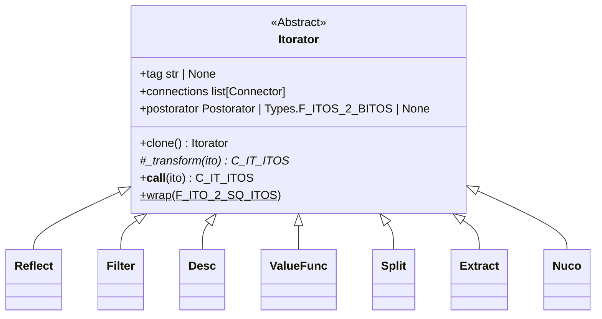

## Concrete Itorator Types

### Reflect

The ``Reflect`` itorator uncondintionally reflects back an input ito:

```python
def _transform(self, ito: Ito) -> Types.C_IT_ITOS:
    yield ito
```

### Filter

The ``Filter`` itorator reflects back the input ito when it matches a given predicate filter:

```python
def _transform(self, ito: Ito) -> Types.C_IT_ITOS:
    if self._filter(ito):
        yield ito
```

The predicate filter is specified in the ctor:

```python
>>> from pawpaw import arborform, Ito
>>> ito_filter = arborform.Filter(lambda ito: str(ito).>>> >>> isnumeric())
>>> for ito in Ito('1a2'):
        for r in ito_filter(ito):
          print(r)
1
2
```

### Desc

The ``Desc`` itorator changes the .desc of an ito and reflects it back:

```python
def _transform(self, ito: Ito) -> Types.C_IT_ITOS:
    if self._filter(ito):
        ito.desc = self._desc_func(ito)
        yield ito
```

The value for the assignment is specified in the ctor:

```python
>>> from pawpaw import arborform, Ito
>>> ito_desc = arborform.Desc('changed')
>>> ito = Ito('abc', desc='original')
>>> rv = next(ito_desc(ito))
>>> print(rv.desc)
changed
```

### ValueFunc

The ``ValueFunc`` itorator changes the .value_func of an ito and reflects it back:

```python
def _transform(self, ito: Ito) -> Types.C_IT_ITOS:
    if self._filter(ito):
        ito.value_func = self.f
        yield ito
```

The value for the assignment is specified in the ctor:

```python
>>> from pawpaw import arborform, Ito
>>> ito_vf = arborform.ValueFunc(lambda ito: int(str(ito)))
>>> ito = Ito('2')
>>> rv = next(ito_vf(ito))
>>> print(rv.value() + 3)
5
```

### Extract

The ``Extract`` itorator applies a regular expression to an ito via ``.regex_finditer``.  Each match is returned back as a pawpaw tree:

```python
import regex 
from pawpaw import arborform, Ito, visualization
s = 'nine 9 ten 10 eleven 11 TWELVE 12 thirteen 13'
pat = r"""
(?:
    (?P<phrase>
        (?P<word>
            (?P<char>\w)+
        )
        \ 
        (?P<number>
            (?P<digit>\d)+
        )
    )\s*
)+
"""
re = regex.compile(pat, regex.VERBOSE)
ito_extract = arborform.Extract(re)
rv = next(ito_extract(Ito(s)))
tree_vis = visualization.pepo.Tree()
print(tree_vis.dumps(rv))
```

results in:

```
(0, 6) 'phrase' : 'nine 9'
├──(0, 4) 'word' : 'nine'
│  ├──(0, 1) 'char' : 'n'
│  ├──(1, 2) 'char' : 'i'
│  ├──(2, 3) 'char' : 'n'
│  └──(3, 4) 'char' : 'e'
└──(5, 6) 'number' : '9'
   └──(5, 6) 'digit' : '9'

(7, 13) 'phrase' : 'ten 10'
├──(7, 10) 'word' : 'ten'
│  ├──(7, 8) 'char' : 't'
│  ├──(8, 9) 'char' : 'e'
│  └──(9, 10) 'char' : 'n'
└──(11, 13) 'number' : '10'
   ├──(11, 12) 'digit' : '1'
   └──(12, 13) 'digit' : '0'

(14, 23) 'phrase' : 'eleven 11'
├──(14, 20) 'word' : 'eleven'
│  ├──(14, 15) 'char' : 'e'
│  ├──(15, 16) 'char' : 'l'
│  ├──(16, 17) 'char' : 'e'
│  ├──(17, 18) 'char' : 'v'
│  ├──(18, 19) 'char' : 'e'
│  └──(19, 20) 'char' : 'n'
└──(21, 23) 'number' : '11'
   ├──(21, 22) 'digit' : '1'
   └──(22, 23) 'digit' : '1'

(24, 33) 'phrase' : 'TWELVE 12'
├──(24, 30) 'word' : 'TWELVE'
│  ├──(24, 25) 'char' : 'T'
│  ├──(25, 26) 'char' : 'W'
│  ├──(26, 27) 'char' : 'E'
│  ├──(27, 28) 'char' : 'L'
│  ├──(28, 29) 'char' : 'V'
│  └──(29, 30) 'char' : 'E'
└──(31, 33) 'number' : '12'
   ├──(31, 32) 'digit' : '1'
   └──(32, 33) 'digit' : '2'

(34, 45) 'phrase' : 'thirteen 13'
├──(34, 42) 'word' : 'thirteen'
│  ├──(34, 35) 'char' : 't'
│  ├──(35, 36) 'char' : 'h'
│  ├──(36, 37) 'char' : 'i'
│  ├──(37, 38) 'char' : 'r'
│  ├──(38, 39) 'char' : 't'
│  ├──(39, 40) 'char' : 'e'
│  ├──(40, 41) 'char' : 'e'
│  └──(41, 42) 'char' : 'n'
└──(43, 45) 'number' : '13'
   ├──(43, 44) 'digit' : '1'
   └──(44, 45) 'digit' : '3'
```

Notes:

* group_filter defaults to only **named** groups, but it can be set to nothing (i.e., allow *all* groups.)  Note that if all groups are allowed, then the output will always consist of a tree whose root is the entire match (group 0), with all other sub-groups present as descendants

* If a group has a name, it will be used as the group key.  Otherwise, its index will be used.

* Even if you filter groups (named or otherwise) in your output, you can still access them them in the match:

```python
>>> import regex
>>> from pawpaw import Ito, arborform
>>> s = 'AB'
>>> re = regex.compile(r'(.)(?<foo>.)')
>>> d = lambda ito, match, group: match.group(1)  # Used first (unnamed) group as descriptor for 'foo'
>>> extract = arborform.Extract(re, desc_func=d)
>>> next(extract(Ito(s)))
Ito(span=(1, 2), desc='A', substr='B')
```

### Invert

The ``Invert`` itorator evaluates a given itorator and returns the conjugates spans of the ito.  The result can optionally include the given itorator's results, in which case it is equivalent to ``Split`` with ``BoundaryRetention.ALL``:

```python
>>> import regex 
>>> from pawpaw import arborform, Ito
>>> ito = Ito('ab12de')
>>> re = regex.compile(r'(?P<number>\d+)')
>>> itor_extract = arborform.Extract(re)
>>> itor_gaps = arborform.Invert(itor_extract, 'non-number')  # include non-gaps
>>> for i in itor_gaps(ito):
...   print(f'{i:%span %desc!r% : %substr!r}')
... 
(0, 2) 'non-number': 'ab'
(2, 4) 'number': '12'
(4, 6) 'non-number': 'de'
>>> 
>>> itor_gaps = arborform.Invert(itor_extract, 'non-number', False)  # exclude non-gaps
>>> for i in itor_gaps(ito):
...   print(f'{i:%span %desc!r% : %substr!r}')
... 
(0, 2) 'non-number': 'ab'
(4, 6) 'non-number': 'de'
```

If you want both the results *and* conjugates of an itorator, use the ``Split`` itorator.

More sophisticated gap-consolidation techniques can be achieved using a ``Posterator`` object.

### Split

The ``Split`` itorator splits an ito based on a ``regex.Pattern`` **or** an arbitrator ``Itorator`` and
returns an ito sequence based on the splits.

Given the ``Ito``:

**P–O–O–S**

where ``P`` is prefix, ``—`` is boundary, ``O`` is/are middle segments(s), and ``S`` is suffix, the beahvior of ``Split`` is governed by the ``BoundaryRetention`` parameter:

| BoundaryRetention | Segments | Description |
| :--: | :--: | :-- |
| ``NONE`` | **P O O S** | boundaries are discarded (this is an 'ordinary' split operation) |
| ``LEADING`` | **–O –O –S** | boundaries kept as prefixes, leading P is discarded |
| ``TRAILING`` | **P– O– O–** | boundaries kept as suffixes, trailing S is discarded |
| ``ALL`` | **P – O – O –** | all non-zero-length boundaries kept as distincts |

The ``BoundaryRetention.ALL`` is useful if you want to extract itos and then process downstream *both* the boundaries and non-boundaries.

Zero-length boundaries are allowable, however, they are not yielded.

The split operation is performed by the ``splitter`` parameter, which can be a ``regex.Pattern`` or an ``Itorator``.  If a ``regex.Pattern`` is provided, an ``Itorator`` is constructed as follows:

```python
splitter = pawpaw.itorator.Extract(
  re,
  desc_func = lambda ito, match, group_key: None,
  group_filter = lambda ito, m, gk: gk == 0,
  tag = f'generated Split for \\{re.pattern}\\'
)
```

In this case, the boundaries are itos corresponding to entire ``regex.Match`` objects (not any sub-groups) with ``.desc`` set to ``None``.

```python
>>> import regex
>>> from pawpaw import Ito, arborform, visualization

>>> s = 'test scores were between 50.1 and 91.6'
>>> splitter = arborform.Split(
... regex.compile('(?<number>\d+(?:\.\d+))'),
... boundary_retention=arborform.Split.BoundaryRetention.ALL,
... desc='non-number'
... )

>>> root = Ito(s, desc='phrase')
>>> for part in splitter(root):
>>>   print(repr(part))

Ito(span=(0, 25), desc='non-number', substr='test scores were between')
Ito(span=(0, 25), desc='', substr='50.1')
Ito(span=(0, 25), desc='non-number', substr=' and ')
Ito(span=(0, 25), desc='', substr='91.6')
```

Better control over yielded boundaries can be achieved by using an Itorator:

```python
>>> import regex
>>> from pawpaw import Ito, arborform, visualization

>>> s = 'test scores were between 50.1 and 91.6'
>>> splitter = arborform.Split(
... arborform.Extract(regex.compile('(?<number>\d+(?:\.\d+))')),
... boundary_retention=arborform.Split.BoundaryRetention.ALL,
... desc='non-number'
... )

>>> root = Ito(s, desc='phrase')
>>> for part in splitter(root):
>>>   print(repr(part))

Ito(span=(0, 25), desc='non-number', substr='test scores were between')
Ito(span=(0, 25), desc='number', substr='50.1')
Ito(span=(0, 25), desc='non-number', substr=' and ')
Ito(span=(0, 25), desc='number', substr='91.6')
```

Using ``Split`` with ``BoundaryRetention.ALL`` allows you to perform extractions and then yield *both* the results and residuals :

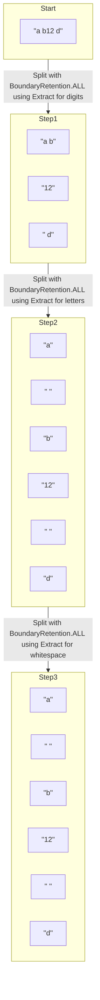

The code for this is as follows:

```python
>>> import regex 
>>> from pawpaw import arborform, Ito
>>> ito = Ito('a b12 d')
>>> extractors = [
...   arborform.Extract(regex.compile('(?P<digits>\d+)')),
...   arborform.Extract(regex.compile('(?P<letters>[a-z]+)')),
...   arborform.Extract(regex.compile('(?P<ws>\s+)'))
... ]
>>> itor = arborform.Reflect()
>>> for e in extractors:
...   splitter = arborform.Split(e, boundary_retention=arborform.Split.BoundaryRetention.ALL)
...   con = arborform.Connectors.Recurse(splitter, lambda ito: ito.desc is None)
...   itor.connections.append(con)
... 
>>> for i in itor(ito):
...   print(f'{i:%span %desc!r% : %substr!r}')
(0, 1) 'letters': 'a'
(1, 2) 'ws': ' '
(2, 3) 'letters': 'b'
(3, 5) 'digits': '12'
(5, 6) 'ws': ' '
(6, 7) 'letters': 'd'
```

### Nuco

The ``Nuco`` itorator performs a null-coallesce for a sequence of itorators, returning the first non-empty result (if any.)

Tip: Add a ``Desc`` or ``Reflect`` as the last itorator in your sequence if you want to return a given ito when all the preceeding itorators fail to match:

```python
>>> from pawpaw import Ito, arborform, visualization, nlp
>>> import regex

>>> s = 'she scored 93.5 on THE test'
>>> root = Ito(s, desc='phrase')

>>> itor_split = arborform.Itorator.wrap(lambda ito: ito.str_split(), tag='str_split')

>>> itor_num = nlp.Number().get_itor()
>>> itor_uc_word = arborform.Extract(regex.compile(r'(?P<uc_word>[A-Z]+)'))
>>> itor_word = arborform.Desc('word')
>>> itor_nuco = arborform.Nuco(itor_num, itor_uc_word, itor_word, tag='nuco num, uc)_word, word')
>>> con = arborform.Connectors.Delegate(itor_nuco)
>>> itor_split.connections.append(con)

>>> root.children.add(*itor_split(root))
>>> v_tree = visualization.pepo.Tree()
>>> print(v_tree.dumps(root))

(0, 27) 'phrase' : 'she scored 93.5 on the test'
├──(0, 3) 'word' : 'she'
├──(4, 10) 'word' : 'scored'
├──(11, 15) 'number' : '93.5'
│  ├──(11, 13) 'integer' : '93'
│  └──(13, 15) 'decimal' : '.5'
├──(16, 18) 'word' : 'on'
├──(19, 22) 'uc_word' : 'THE'
└──(23, 27) 'word' : 'test'
```

## Connector

Data flow between Itorators is indicated through ``Connector`` objects.  

A connector object consists of a single ``Itorator`` and an optional predicate[^predicate]:

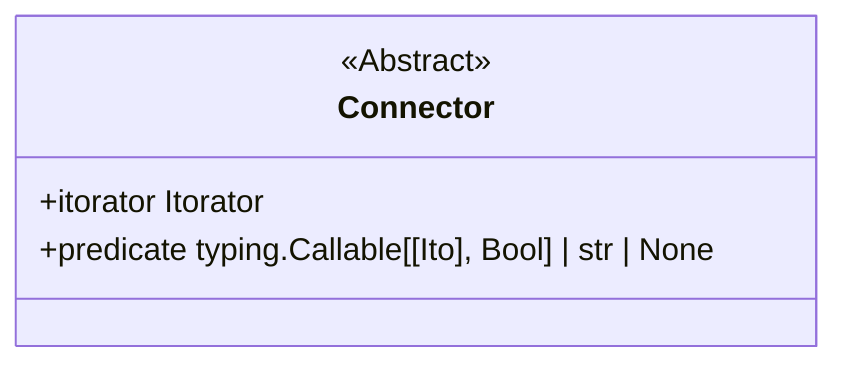

A variety of concrete connector classes are available:

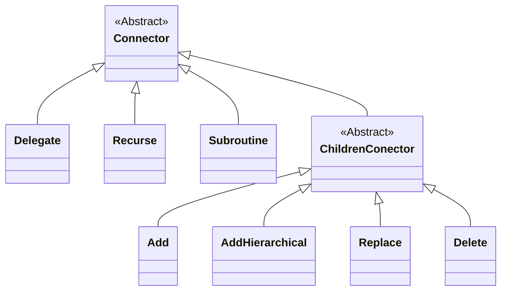

The behavior of each concrete type is explained in [The Pipeline](https://github.com/rlayers/pawpaw/blob/master/docs/4.%20Arborform.md#the-pipeline).

## The Pipeline

To create a pipeline, wrap a target itorator in a ``Connection`` and add it to the ``.connections`` list of another:

```python
>>> itor_1 = arborform.Reflect()
>>> itor_2 = arborform.Trim()
>>> itor_1.connections.append(Connectors.Delegate(itor_2))
```

Data will now flow unconditionally from itor_1 to ito_2:

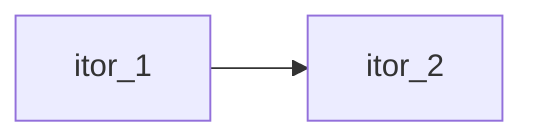

Conditional flow can be achieving by adding a predicate to the Connector object:

```python
>>> itor_1.connections.clear()
>>> itor_1.connections.append(Connection.Delegate(itor_2, lambda ito: len(ito) > 1)
```

Now flow moves conditionally from from itor_1 to itor_2:

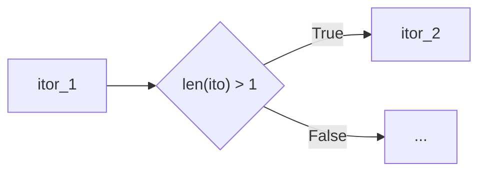

Note that a default tautology[^tautology] is used if a predicate is not supplied to the connector's constructor.  In other words, ``Connector`` objects *always* have a value for their predicate.

The most commonly predicates are:

```python
lambda ito: ito.desc is None
lambda ito: ito_desc = 'some value'
```

These predicates are via the overloaded ``str`` and ``None`` types for predicate, which if supplied create the associated lambdas shown above:

| Predicate Type | Example Input | Result |
| :--: | :--: | :--: |
| ``None`` | ``None`` | ``lambda ito: ito.desc is None`` |
| ``str`` | ``abc`` | ``lambda ito: ito.desc == 'abc'`` |
| ``typing.Callable[[Ito], bool]`` | ``lambda ito: len(ito) > 3`` | ``lambda ito: len(ito) > 3`` |

Pipelines are constructed using an itorator's ``.connections`` property, which comprises a list of ``Connector`` objects.  Each connector has an itorator, which can have its own list connectors, along with a predicate.

Itorator invocation can be visualized with the following pseudo-code:

```python
clone = ito.clone()
for cur in self._transfrom(clone):
    for connector self.connections
        if connection.predicate(cur):
            <impl>
    yield ito
```

For brevity, assume ``f = connection.itorator.__call'__``.  The behavior of <impl> is as follows:

| Connector | Description | Typical Usage |
|:---------------|:-----------------------|:-----------------------|
| ``Connectors.Delegate`` | 1. Yields ``f(cur)``<br> (breaks out of inner loop) | Cannonical |
| ``Connectors.Recurse`` | 1. Invokes ``f(cur)``<br>2. Continues inner loop with result | Connect to multiple end-points of a sub-flow; invoke further transformations in owning itorator's connection chain|
| ``Connectors.Subroutine`` | 1. Invokes ``f(cur)``<br>2. Continues inner loop with ``cur`` (instead of result) | Perform non-generative modifications (such as altering an ito's ``.desc``, ``.children``, etc.); generative transformations that create new ito(s) are not carried forward and therefore lost |
| ``Connectors.Children.Add`` | 1. Caches result of ``f(cur)``<br>2. Adds cached result to cur.children<br>3. Yields cached result<br>4. Breaks out of inner loop | adding children |
| ``Connectors.Children.AddHierarchical`` |  1. Caches result of ``f(cur)``<br>2. Adds cached result hierarchically to cur.children<br>3. Yields cached result<br>4. Breaks out of inner loop | adding children  hierarchically |
| ``Connectors.Children.Replace`` | 1. Caches result of ``f(cur)``<br>2. Clears cur.children<br>3. Adds cached result to cur.children<br>4. Yields cached result<br>5. Breaks out of inner loop | adding or replacing children |
| ``Connectors.Children.Delete`` | 1. Caches result of ``f(cur)``<br>2. Calls ``cur.children.delete`` for each item in cached result<br>3. Yield cached result<br>4. Breaks out of inner loop | deleting children |

If an itorator has a ``.postorator``, the result the entire flow is wrapped in an iterator and passed to it.

### ``Connectors.Recurse``

The ``Recurse`` connector passes a flow to the associated itorator.   The results are then fed to the next itorator in the pipeline.

Note that the ``Recurse`` connector is useful when designing a *sub-pipeline* that has multiple end-points and whose output needs to be sent to another itorator:

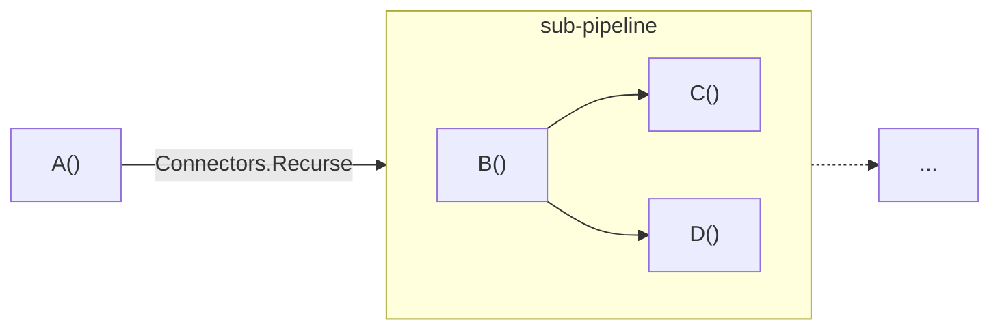

By using a ``Sub`` connector, the output of both C and D will be fed into the next itorator in a connections list.

### ``Connectors.Delegate``

The ``Delegate`` connector passes flow to the associated itorator, and the results are then immediately yielded *without passing them to any subsequent itorators* in the pipeline.

```python
>>> from pawpaw import Ito, arborform, visualization
>>> s = 'Hello, world!'
>>> i = Ito(s)
>>> itor_reflect = arborform.Reflect()  # Reflects current ito (no transformation)
>>> vis_compact = visualization.pepo.Compact()
>>> for result in itor_reflect(i):
...    print(vis_compact.dumps(result))
1: (0, 13) None : 'Hello, world!'
>>> 
>>> itor_desc = arborform.Desc('Changed')  # Changes descriptor
>>> con = arborform.Connectors.Delegate(itor_desc)
>>> itor_reflect.connections.append(con)
>>> for result in itor_reflect(i):
...    print(vis_compact.dumps(result))
1: (0, 13) 'Changed' : 'Hello, world!'
```

### ``Connectors.Subroutine``

The ``Subroutine`` connector passes flow to an itorator whose output is ignored.  The flow is then then fed to the next itorator in the pipeline.  This type of connection is useful for diagnostic purposes.  For example, the flow could be passed to a visualization routine that displays the current flow status.

Alternatively, where the itorator only *modifies* a given ito, rather than *generating* a new one(s), the output of ``Subroutine`` will have an effect.

### ``Connectors.Children``

When you need to apply the output of an itorator *to the children* of a given input Ito, several connections types are available:

| Connectors.Children Type | Description | Pseudocode |
|:---:|:---:|:---|
| Add | Adds the results to the input ito's children | input_ito.children.add(*results) |
| AddHierarchical | Adds the results hierarchically to the input ito's children | input_ito.children.add_hierarchical(*results) |
| Replace | Replaces the results to the input ito's children | input_ito.children.clear()<br/>input_ito.children.add(*results)|
| Delete | Removes the results from the input ito's children | for r in results:<br/>&nbsp;&nbsp;&nbsp;&nbsp;input_ito.children.remove(r)|

#### Example:

```python
>>> from pawpaw import Ito, arborform, visualization
>>> s = 'Hello, world!'
>>> i = Ito(s)
>>> split_words = arborform.Itorator.wrap(lambda ito: ito.str_split())  # str split
>>> split_chars = arborform.Itorator.wrap(lambda ito: [*ito])  # extract char itos
>>> con = arborform.Connectors.Children.Add(split_chars)
>>> split_words.connections.append(con)
>>> tree_vis = visualization.pepo.Tree()
>>> for result in split_words(i):
>>>   print(tree_vis.dumps(result))
(0, 6) 'None' : 'Hello,'
├──(0, 1) 'None' : 'H'
├──(1, 2) 'None' : 'e'
├──(2, 3) 'None' : 'l'
├──(3, 4) 'None' : 'l'
├──(4, 5) 'None' : 'o'
└──(5, 6) 'None' : ','

(7, 13) 'None' : 'world!'
├──(7, 8) 'None' : 'w'
├──(8, 9) 'None' : 'o'
├──(9, 10) 'None' : 'r'
├──(10, 11) 'None' : 'l'
├──(11, 12) 'None' : 'd'
└──(12, 13) 'None' : '!'
```

## Advanced Chaining

### Sub-pipelines

Complex connections will result in an ``Itorator`` having *multiple* flow paths.  For example:

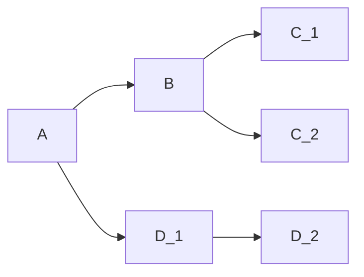
If this is your entire pipeline, then invoking A will yield the output of either C_1, C_2, or D_2, as expected, and nothing more need be done.

Alternatively, sometimes you'll need to *merge* flow paths.  For example, you might need a final processing step, Z, be performed on all three paths:

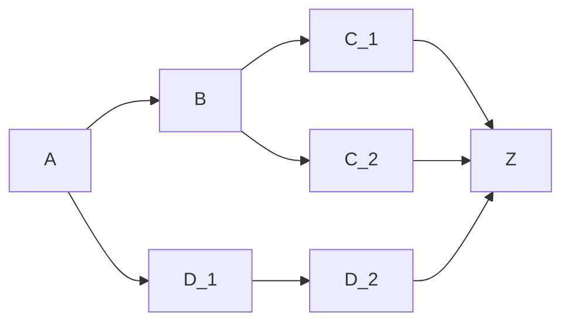

You can do this by making A a ``Sub`` to it's parent.  The output, whether from C_1, C_2, or D_2 will be returned back up to the stack to A's parent.  Alternatively, if A has no parent, a stub ``Reflect`` itorator can be used instead:

```python
>>> itor_A = ...
>>> itor_reflect = arborform.Reflect(...)
>>> con = arborform.Connectors.Sub(itor_reflect)
>>> itor_A.connections.append(con)
>>> itor_B = ...
>>> con = arborform.Connectors.Delegate(itor_B, some_predicate)
>>> itor_reflect.connections.append(con)
>>> ...
```

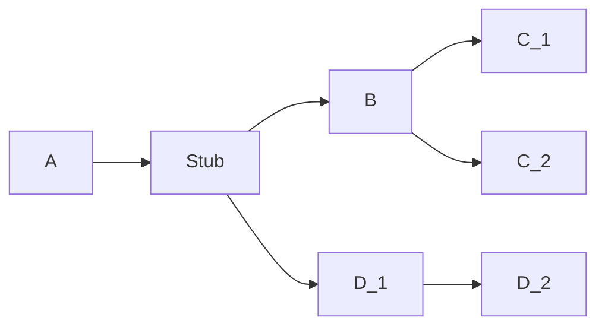

## Postorator

The ``Postorator`` class offers a way to perform post-itorator operations, such as aggregation and other combinatorics.  Unlike itorators, whose key ability is to transform a *single* ito, class ``Postorator`` operates on ito *sequences*.

### Postorator Class Diagram

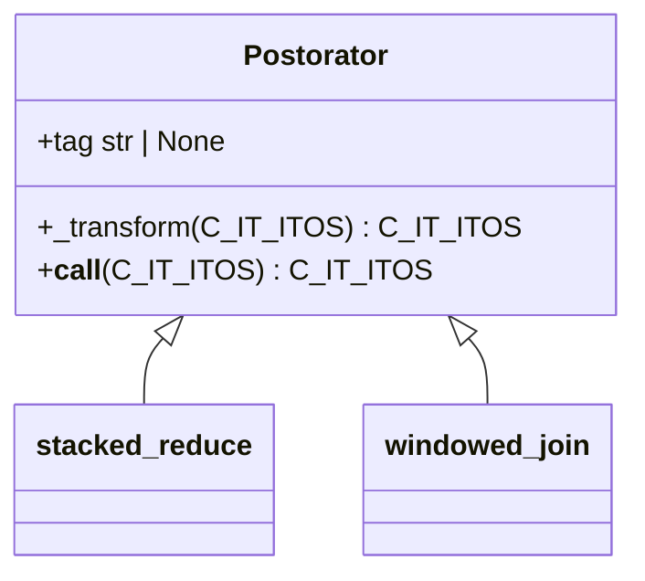

Unlike itorators, which can be chained, posterators can be bound singly to an itorator:

```python
from pawpaw import Ito, arborform, Types
import regex
s = 'one two 3 4 five'
root = Ito(s)
splitter = arborform.Split(regex.compile(r'\s+'))
print([*splitter(root)])
print()

def combine_likes(itos: Types.C_IT_ITOS) -> Types.C_IT_ITOS:
  isdigit = False
  stack = []

  def merge_stack():
    yield Ito.join(*stack, desc='numerics' if isdigit else 'alphabetics')
    stack.clear()

  for i in itos:
    if len(stack) == 0:
      isdigit = i.str_isdigit()
      stack.append(i)
    elif i.str_isdigit() == isdigit:
      stack.append(i)
    else:
      yield from merge_stack()
      isdigit = i.str_isdigit()
      stack.append(i)

  if len(stack) > 0:
    yield from merge_stack()

splitter.postorator = arborform.Postorator.wrap(combine_likes)
print([*splitter(root)])
```

will output:

```python
[Ito(span=(0, 3), desc='', substr='one'), Ito(span=(4, 7), desc='', substr='two'), Ito(span=(8, 9), desc='', substr='3'), Ito(span=(10, 11), desc='', substr='4'), Ito(span=(12, 16), desc='', substr='five')]

[Ito(span=(0, 7), desc='', substr='one two'), Ito(span=(8, 11), desc='', substr='3 4'), Ito(span=(12, 16), desc='', substr='five')]
```

*** Additional documentation still being written... ***

[^python_iter_gen]: See [generator objects](https://docs.python.org/3/c-api/gen.html) and [iterator objects](https://docs.python.org/3/c-api/iterator.html) for more information.

[^itorator_name]: The name "Itorator" comes from a portmanteau of "Ito" and "Iterator"

[^predicate]: A function that returns a Boolean value.

[^tautology]: A function that always returns True.

[^callable_object]: See [object.__call__](https://docs.python.org/3/reference/datamodel.html#object.__call__) in Python docs for more detail.

[^furcation_name]: A "Furcation" is the act or process of forking or branching out, e.g., bifurcation, trifurcation, etc.

