# Arborform

## Introduction

If you've written complex text parsers before, you might have noticed a pattern in your projects.  Your initial, first-attempt parsers seem to almost write themselves.  Things are going great!  But as you continue to implmeent more and more rules, your code base starts to become large and unweildy.  Small changes to one part have unintended consequences for other parts, and it becomes harder to visualize state at arbitrary points in your program's flow.

Consider the following sequence of NLP tasks you might want to perform against a passage of text:

1. Trim whitespace from ends
2. Split paragraphs
3. Split words (tokenize)

It might be possible to perform all of the tasks in one go using a single regular expression.  However, for reasonable precision and accuracy, the pattern would be long, complex, and difficult to maintain.  If additional tasks need to be inserted or appended, a single regular expression would eventially become too unweildy.

An alternative approach would be to perform each task sequentially, feeding the results of one into the next:

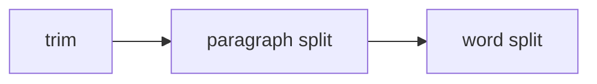

Such an approach is a *pipeline*.  In a pipeline, each task is encapsulated, which simplifies the implementation of any individual task; makes it easy to keep track of state, and trivialies the insertion or deletion of tasks from the overall pipeline.

Pawpaw's arborform module enables the rapid creation of complex, pipelined text parsers.  Pipelines are implemented in arborform using the Python generator/iterator[^python_iter_gen] idiom and achieve a reasonable mixture of performance and memory conservation.  The resulting architecture is highly flexible and scalable, and is highly flexible and scalable for your needs.  The key classes in arborform are:

* ``Itorator``[^itorator_name]: Generator-based ``Ito`` transformation
* ``Connector``: Defines connection type between itorators
* ``Postorator``: Generator-based ``Iterable[Ito]`` consolidation

## Itorator

The ``Itorator`` class encapsulates a single *transformation* step in a parser pipeline, whereby a given ``Ito`` is transformed into zero, one, or more itos, represented by a ``typing.Iterable[Ito]``.  Examples of transformations you may wish to perform are:

* Use ``.str_strip`` to get a shortened ito
* Split an ito into multiple itos
* Filter out an ito so that it doesn't show in the final output

Itorators are callable objects[^callable_object], which allows you to invoke them using simple function syntax.  The single input parameter is an ``Ito``, and the return type is a generator, which you can iterate over, unpack into a container, etc:

```python
>>> from pawpaw import Ito, arborform
>>> s = 'Hello, world!'
>>> i = Ito(s)
>>> i  # Starting ito has no .desc
Ito('Hello, world!', 0, 13, None)
>>> itor_desc = arborform.Desc('changed')  # Desc itorator: changes .desc property
>>> next(itor_desc(i))  # Invoke itorator and get first item from pipeline
Ito('Hello, world!', 0, 13, 'changed')
```

When invoked, an itorator clones the input Ito, ensured that it is left unaltered:

```python
>>> i  # Original remains unmodified
Ito('Hello, world!', 0, 13, None)
```

Transformations are performed in the ``._transform`` method, which is abstract for the base class ``Itorator``.  The ``._transform`` method is not intended to be called directly, rather, it is available for you to override in derived classes.  Several concrete itorators with implementations for ``._transform`` are available:

| Concrete Class | Description                                          |
|:---------------|:-----------------------------------------------------|
| ``Reflect``    | Returns an unaltered ito                             |
| ``Filter``     | Conditionally reflects an ito                        |
| ``Desc``       | Alters the ``.desc`` for an ito and returns it       |
| ``ValueFunc``  | Alters the ``.value_func`` for an ito and returns it |
| ``Split``      | Splits an ito and returns the result                 |
| ``Extract``    | Extracts and return an ito hierarchy                 |

The arborform module also supports dynamically defining ``._transform`` behavior via the ``Itorator.wrap`` method.  This method creates a *wrapped, concrete itorator* whose behavior is defined by a method parameter you pass to it: 

```python
>>> from pawpaw import Ito, arborform
>>> s = 'Hello, world!'
>>> i = Ito(s)
>>> itor = arborform.Itorator.wrap(lambda ito: ito.str_split())
>>> for r in itor(i):
...   print(r)
Hello,
world!
```

Note that the return type for your wrapped transformation must be ``typing.Iterable[Ito]``.  If your intent is to return a single ``Ito``, you can:

* use a single ``yield`` statement
* return a single element long ``tuple``, ``list``, or other iterable collection 

Note that if you use a ``return`` statement with a single Ito, the *ito itself* will be treated as iterable return type.  This can be useful if you need to return a series of one character long itos.

```python
>>> from pawpaw import Ito
>>> from pawpaw.arborform import Itorator
>>> i = Itorator.wrap(lambda i: [i.clone()])  # ok: returns a list with 1 ito
>>> [*i(Ito('abc'))]
[Ito('abc', 0, 3, None)]

>>> i = Itorator.wrap(lambda i: (i.clone(),))  # ok: returns a tuple with 1 ito
>>> [*i(Ito('abc'))]
[Ito('abc', 0, 3, None)]

>>> i = Itorator.wrap(lambda i: i.clone())  # warning: returns an Ito...
>>> [*i(Ito('abc'))] # ...which is also a 3-Ito sequence
[Ito('abc', 0, 1, None), Ito('abc', 1, 2, None), Ito('abc', 2, 3, None)]
```

``Itorator`` also features a ``.tag`` property, which is a convenience field that allows you to assign arbitrary labels in order to assist in the development and testing of your pipelines.

Itorator chaining is implemented via the ``.connections`` property.  For more details, refer to [The Pipeline](https://github.com/rlayers/pawpaw/blob/master/docs/4.%20Arborform.md#the-pipeline) below.

### Itorator Class Diagram

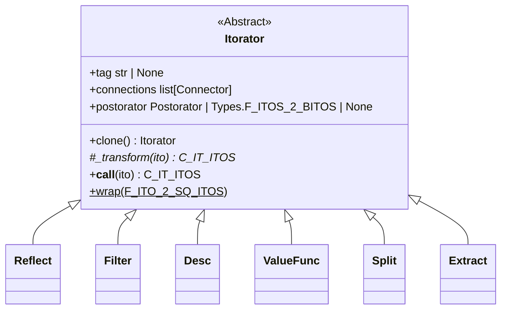

## Connector

Data flow between Itorators is indicated through ``Connector`` objects.  

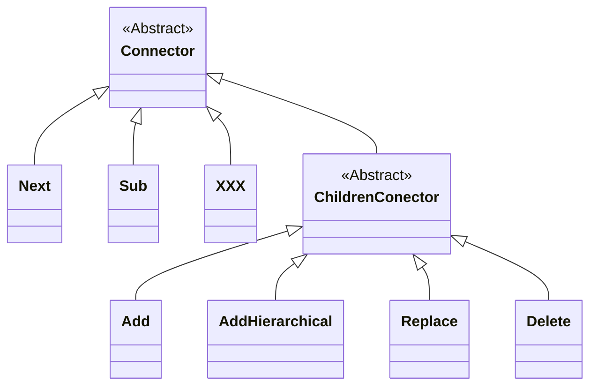

Concrete connector classes are available within the ``Connectors`` utility class, and have behavior as follows:

| Connector | Description |
|:---------------|:-----------------------------------------------------|
| ``Connectors.YieldBreak`` | Calls an itorator, yields its results, and movest to the next item after current  |
| ``Connectors.Assign`` | Calls an itorator, assigns its results to current, and continues on to the next connection |
| ``Connectors.Sub`` | Calls an itorator, ignores the results, and continues on to the next connection using current |
| ``Connectors.Children.Add`` | Calls an itorator and adds the results to current's children |
| ``Connectors.Children.AddHierarchical`` | Calls an itorator and adds the results hierarchically to current's children |
| ``Connectors.Children.Replace`` | Calls an itorator, caches the result, clears current's children; adds the cached results to current's children |
| ``Connectors.Children.Delete`` | Calls an itorator and deletes the results from current's children |

A connector object consists of a single ``Itorator`` and an optional predicate[^predicate]:

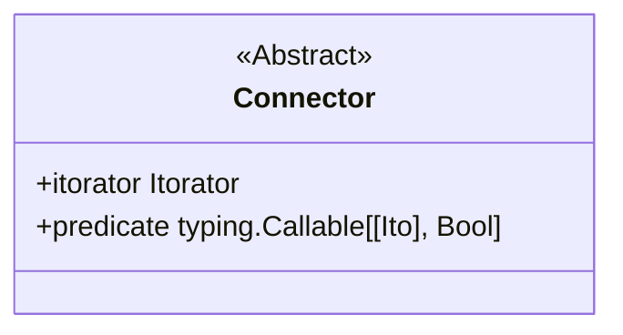

## The Pipeline

Pipelines are constructed using an itorator's ``.connections`` property, which comprises a list of ``Connector`` objects.  Each connector has an itorator, which can have its own list connectors, along with a predicate.

Invoking an itorator involves the following steps:

1. The input ito is cloned
2. The ``._transform`` is called on the clone, creating a iterator
3. The iterator is traversed, for each ito (current)...
4. ...connections is traversed, and for each connector...
5. If the connector predicate is True, the connector itorator is evaluated
6. If false, current flows to the next connector in connections
7. If no further connectors are available, the current is yielded

If the itorator has a ``.postorator``, then the iterator is passed to it, and its results are yielded.

A pipeline involves two or more itorators.  To create one, wrap the target itorator in a ``Connection``, and add it to the ``.connections`` list of the first:

```python
>>> itor_1 = arborform.Reflect()
>>> itor_2 = arborform.Trim()
>>> itor_1.connections.append(Connections.YieldBreak(itor_2))
```

In this case, data flow moves unconditionally from itor_1 to ito_2:

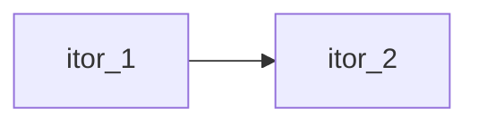

Conditional flow can be achieving by adding a predicate to the Connector object:

```python
>>> itor_1.connections.clear()
>>> itor_1.connections.append(Connection.YieldBreak(itor_2, lambda ito: len(ito) > 1)
```

Now flow moves conditionally from from itor_1 to itor_2:

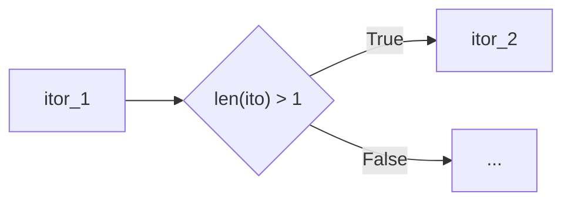

Note that a default value of a tautology[^tautology] is used if a predicate is not supplied to the connector's constructor.  In other words, ``Connector`` objects *always* have a value for their predicate.

## DOCUMENTATION BEYOND THIS POINT IS NOW DEPRECATED

The ``.itor_next`` property is feeds an ito sequence as a *lateral* flow.  This is the most basic type of pipeline connection:

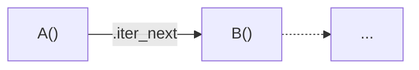

I.e., each ``Ito`` in the sequence is passed to an ``Itorator`` which then **transforms** it via its ``._transform`` method.  For example, an ``Itorator`` that performs a word split can pass its output to another ``Itorator`` that performs a char split.  The overall output will consist of char ``Ito`` objects:

```python
>>> from pawpaw import Ito, arborform, visualization
>>> s = 'Hello, world!'
>>> i = Ito(s)
>>> split_reflect = arborform.Reflect()  # Reflects current ito (no transformation)
>>> vis_compact = visualization.pepo.Compact()
>>> for result in split_words(i):
>>>   print(vis_compact.dumps(r)
1: (0, 13) 'None' : 'Hello, world!'
>>>
>>> itor_desc = arborform.Desc(lambda ito: 'Changed')  # Changes descriptor
>>> itor_reflect.itor_next = itor_desc
>>> for result in split_words(i):
>>>   print(vis_compact.dumps(r)
1: (0, 13) 'Changed' : 'Hello, world!'
```

### ``itor_children``

The ``.itor_children`` feeds an ito sequence as a *downward flow*.  Each ``Ito`` in the sequence is passed to an ``Itorator`` whose output is then appended to the ito's children:

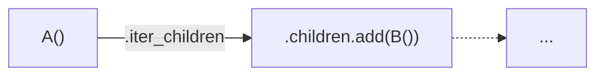

For example, an ``Itorator`` that performs a word split can pass its output to another ``Itorator`` that performs a char split.  The overall output will consist of *trees* whose roots are words and leaves are chars:

```python
>>> from pawpaw import Ito, arborform, visualization
>>> s = 'Hello, world!'
>>> i = Ito(s)
>>> split_words = arborform.Itorator.wrap(lambda ito: ito.str_split())  # str split
>>> split_chars = arborform.Itorator.wrap(lambda ito: [*ito])  # extract char itos
>>> split_words.itor_children = split_chars
>>> tree_vis = pawpaw.visualization.pepo.Tree()
>>> for result in split_words(i):
>>>   print(tree_vis.dumps(result))
(0, 6) 'None' : 'Hello,'
├──(0, 1) 'None' : 'H'
├──(1, 2) 'None' : 'e'
├──(2, 3) 'None' : 'l'
├──(3, 4) 'None' : 'l'
├──(4, 5) 'None' : 'o'
└──(5, 6) 'None' : ','

(7, 13) 'None' : 'world!'
├──(7, 8) 'None' : 'w'
├──(8, 9) 'None' : 'o'
├──(9, 10) 'None' : 'r'
├──(10, 11) 'None' : 'l'
├──(11, 12) 'None' : 'd'
└──(12, 13) 'None' : '!'
```

### ``itor_sub``

The ``.itor_sub`` property is used to define a *sub-pipeline*.  Using sub-pipelines allows you to better encapsulate regions within a pipeline, and to provide a single connection point for subsequent processing.

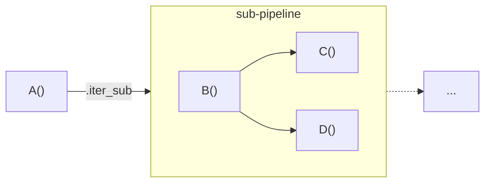

An itorator can have values for any combination of ``.itor_sub``, ``.itor_next``, & ``.itor_children``.  If no connections are specified, then no further processing take place and the given ito sequence is yielded back to the previous pipeline segment.

### Order of Evaluation

The order of evaluation for an ``Itorator`` is as follows:

1. ``._transform`` : Ito → Sequence
2. ``.itor_sub`` : Sequence → Sequence
3. ``.itor_children`` : Sequence → Sequence
4. ``.itor_next`` : Sequence → Sequence

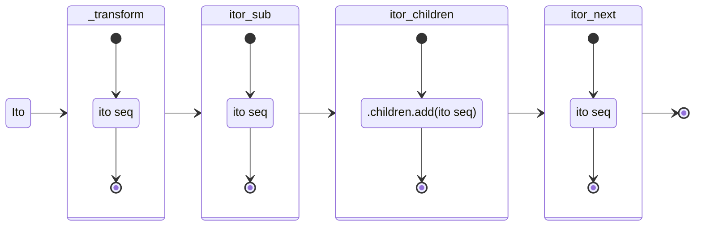

### Pipeline Branching

In the examples so far, ``.itor_sub``, ``.itor_next``, & ``.itor_children`` were set to a *single* Itorator.  This results in unconditional flow to the subsequent ``Itorator``.

Alternatively, you can *conditionally* flow using a predicate.  For example:

```python
>>> from pawpaw import Ito, arborform
>>> s = '4 out of 5'
>>> i = Ito(s)
>>> split_lexer = arborform.Itorator.wrap(lambda ito: ito.str_split())
>>> int_value_func = arborform.ValueFunc(lambda i: int(str(i)), 'integer')
>>> non_int_val = arborform.Desc('non-int')
>>> split_lexer.itor_next = lambda ito: ito.str_isnumeric(), int_value_func  # conditional flow - if predicate():
>>> for ito in split_lexer(i):
>>>    print(f'substr: {ito:%substr!r}; .value(): {repr(ito.value())}')
substr: '4'; .value(): 4
substr: 'out'; .value(): 'out'
substr: 'of'; .value(): 'of'
substr: '5'; .value(): 5
```

The example above flows from split_lexer to int_value_func **if** a given ito is numeric:

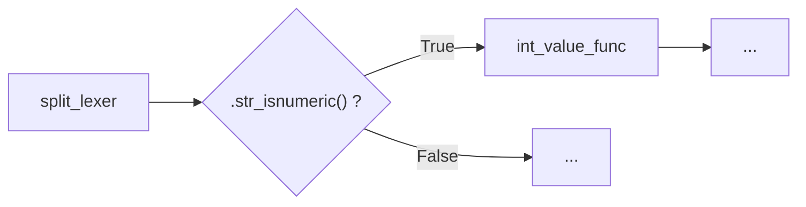


## Parsing Strategy

## Concrete Itorator Types

### Extract

Notes:

* group_filter defaults to only **named** groups, but it can be set to nothing (i.e., allow *all* groups.)  Note that if all groups are allowed, then the output will always consist of a tree whose root is the entire match (group 0), with all other sub-groups present as descendants

* If a group has a name, it will be used as the group key.  Otherwise, its index will be used.

* Even if you filter groups (named or otherwise) in your output, you can still access them them in the match:

```python
>>> import regex
>>> from pawpaw import Ito, arborform
>>> s = 'AB'
>>> re = regex.compile(r'(.)(?<foo>.)')
>>> d = lambda ito, match, group: match.group(1)  # Used first (unnamed) group as descriptor for 'foo'
>>> extract = arborform.Extract(re, desc_func=d)
>>> next(extract(Ito(s)))
Ito('AB', 1, 2, 'A')
```

## Advanced Chaining

### Simple Pipeline Conections

The most frequent pipeline connections are a) unconditional flow to a single ``Itorator`` and b) conditional flow to a single ``Itorator`` (otherwise None.)  The ``.itor_next`` and ``.itor_children` properties are highly overloaded, and directly support setting these two connection types:

```python
>>> itor_1.itor_next = itor_2  # unconditional lateral flow (itor_1 → itor_2)
>>> itor_1.itor_child = lambda ito: ito.desc = 'parent', itor_3  # conditional downward flow (itor_1 ↓ itor_2)
```

### Chaining Internals

Internally, the ``.itor_next`` and ``.itor_children`` properties have overloaded setters that support this type of varied syntax.  The underlying data for both of these is a specialized list of *monad-like* predicate-value pairs.  Each pair is modeled in Pawpaw as the class ``PredicatedValue``.  Predicates are Python callable objects with a single parameter, ``Ito``, and which return a ``bool``.  Values are either an ``Itorator`` or ``None``.

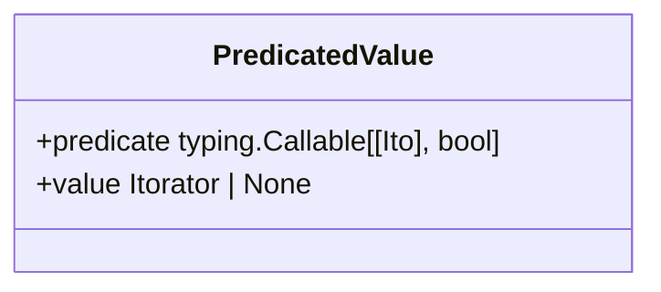

The specialized list of ``PredicatedValue`` is modeled in Pawpaw as class ``Furcation``[^furcation_name].  Evaluation of a ``Furcation`` for a given ``Ito`` is done by evaluating each predicate in sequential order until a value of ``True`` is obtained, at which point the associated value (an ``Itorator`` or ``None``) is returned.  If no predicate returns ``True``, then ``None`` is returned.

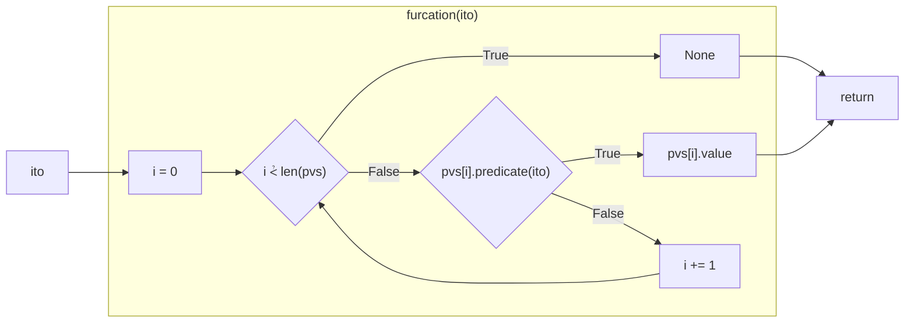

Although complex, this furcation-based architecture has several key advantages:

* Better run-time type checks
* Pipeline visualization

The ``.itor_next`` and ``.itor_children` properties setters actually perform a transformation based on the value type passed, and initialize the furcation list with the result:

|         Value Type         |               Transformation               |  len(Furcation)  |
|:--------------------------:|:------------------------------------------:|:----------------:|
|            None            |                    N/A                     |        0         |
|          Itorator          | PredicateValue(Furcation.tautology, value) |        1         |
| tuple(Predicate, Itorator) |     PredicateValue(value[0], value[1])     |        1         |
|         Predicate          |        PredicateValue(value, None)         |        1         |
|       PredicateValue       |                   value                    |        1         |

Note that ``PredicateValue`` with a ``.value`` of None is perfectly valid.  When only an itorator is passed, a placeholder predicate, ``Furcation.tautology``, is used[^tautology].  In such a case, the furcation evaluation always returns the given ``Itorator``.

For more complex, multi-predicate control flows, simply use standard list accessors methods (e.g. ``.append``, ``.extend``, ``.insert``, etc.) of the ``Furcation`` object.  These methods are also overloaded, allowing you to pass either:

1. ``Predicate``
2. ``Itorator``
3. ``tuple[Predicate, Itorator]``
4. ``PredicatedValue``

Example:

```python
>>> itor_1.itor_next = itor_2  # init
>>> itor_1.itor_next.append((func_1, itor_3)) # append tuple
>>> itor_1.itor_next.append(func_2) # append predicate
>>> itor_1.itor_next.append(itor_4) # append itorator
```

### Sub-pipelines

Complex connections will result in an ``Itorator`` having *multiple* flow paths.  For example:

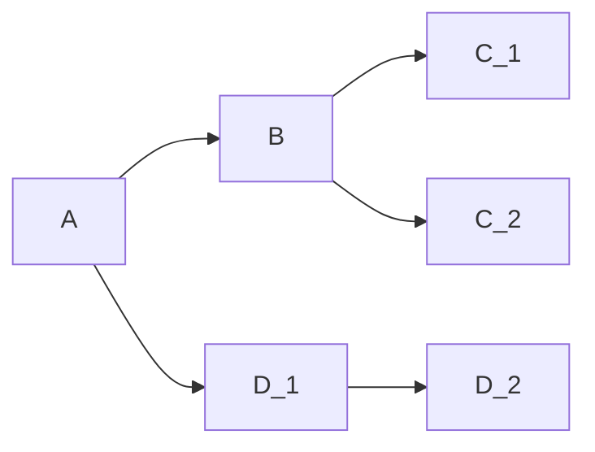
If this is your entire pipeline, then calling ``.traverse`` on A yield the output of either C_1, C_2, or D_2, as expected, and nothing more need be done.

Alternatively, sometimes you'll need to *merge* flow paths.  For example, you might need a final processing step, Z, be performed on all three paths:

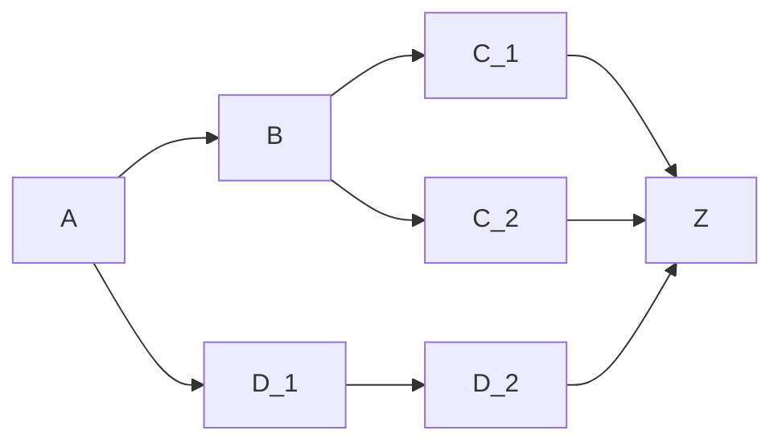

You can do this by adding Z to each of the three itorators' ``.itor_next`` furcations:

```python
>>> A.itor_next = F1, B
>>> A.itor_next.append(D_1)
>>> B.itor_next = F2, C_1
>>> B.itor_next.append(C_2)
>>> D_1.itor_next = D_2
>>> # Merge all three branches
>>> C_1.itor_next = Z
>>> C_2.itor_next = Z
>>> D_2.itor_next = Z
```

Although valid, this approach can problematic for complex pipelines.  As you develop your pipelines, and paths are being added, altered, and deleted, you will need to be vigilant about removing and re-adding the final merge step for all affected branches.  More than likely, you will overlook one and your pipeline will be incorrect.

Alternatively, these complex chains can be managed using ``.itor_sub``, which is used to define a encapsulated *sub-pipeline* with a **single output**:

```mermaid
flowchart LR
A -->|.itor_sub| S
  S -->|.itor_sub| B
  S -->|.itor_sub| D.1
subgraph S[sub-pipeline]
  direction LR
  A.1(["."]) --> B
  A.1(["."]) --> D.1
  B -->|.itor_next| C.1
  B -->|.itor_next| C.2
  D.1 -->|.itor_next| D.2
end
  S -->|.itor_next| Z
  ```

The code for this is as follows:

```python
>>> A.itor_sub = F1, B
>>> A.itor_sub.append(D_1)
>>> B.itor_next = F2, C_1
>>> B.itor_next.append(C_2)
>>> D_1.itor_next = D_2
>>> A.itor_next = Z
```

Creating a wrapped ``Itorator`` results in a single end-point to which you can connect to.  As you revise the sub-pipeline, the final merged connection is unaffected, and you are relieved from having to manage the merge code for each and every sub-path:

```python
>>> A.itor_next = F1, B
>>> A.itor_next.append(D_1)
>>> B.itor_next = F2, C_1
>>> B.itor_next.append(C_2)
>>> C_2.itor_next = C_3  # new node
>>> D_1.itor_next = D_2
>>> # Wrap
>>> wrapped = Itorator.wrap(A)
>>> wrapped.itor_next = Z  # revised sub-pipeline still merged correctly
```

## Postorator

Coming soon...

### Postorator Class Diagram

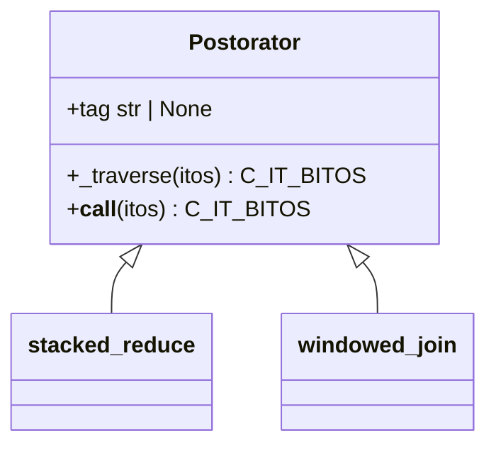

[^python_iter_gen]: See [generator objects](https://docs.python.org/3/c-api/gen.html) and [iterator objects](https://docs.python.org/3/c-api/iterator.html) for more information.

[^itorator_name]: The name "Itorator" comes from a portmanteau of "Ito" and "Iterator"

[^predicate]: A function that returns a Boolean value.

[^tautology]: A function that always returns True.

[^callable_object]: See [object.__call__](https://docs.python.org/3/reference/datamodel.html#object.__call__) in Python docs for more detail.

[^furcation_name]: A "Furcation" is the act or process of forking or branching out, e.g., bifurcation, trifurcation, etc.

