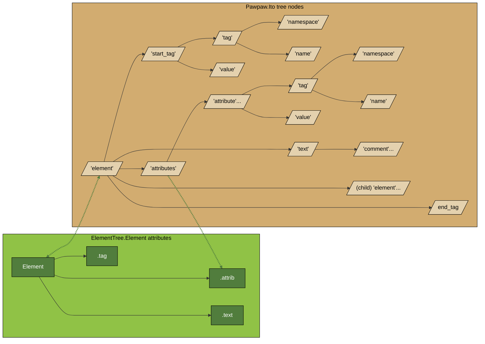

# XML

## Introduction

Pawpaw provides offers enhanced XML processing capabilities in its ``xml`` namespace.  The classes and sub-namespaces are as follows:

## descriptors

Pawpaws ``xml.descriptors`` contains constants used for constructed itos: 

```python
ATTRIBUTE: str = 'attribute'
COMMENT: str = 'comment'
ELEMENT: str = 'element'
END_TAG: str = 'end_tag'
NAME: str = 'name'
NAMESPACE: str = 'namespace'
PI: str = 'pi'
START_TAG: str = 'start_tag'
TAG: str = 'tag'
TEXT: str = 'text'
VALUE: str = 'value'
```

You can use the literals or constants in your code.  For example, the following two lines are equivalent:

```python
ito.find('*[d:element]'))
```

```python
ito.find(f'*[d:{xml.descriptors.ELEMENT}]')
```

## XmlParser

Pawpaw's ``XmlParser`` class is a drop-in replacement for Python's ``ElementTree.XmlParser``.  Both return identical graphs of ``Element``
objects, however, the ``Element`` objects produced by the Pawpaw parser are decorated with an additional ``.ito`` attribute that
returns a corresponding ``Ito`` corresponding to the substring the ``Element`` was extracted from.  These ``Ito`` objects, in turn, have
their ``.value_func`` set to return their associated ``Element`` objects.  All of the ``Ito`` objects are fully hierarchical
with one another back to the topmost (root) node of the overall XML document, and have children corresponding to tags, attributes,
and text.

Using the PawPaw parser results in two, parallel datastructures that are cross-linked to each other at every element.  This allows
you to use *either* data structure where convenient.  You can even swtich back and forth as needed.

```python
>>> root.find('*').ito.find(f'*[d:{xml.descriptors.TEXT}]')  # Get untransformed text of element
```

### Usage

Pawpaw's ``XmlParser`` dervies from ``xml.ElementTree.XmlParser``, which by default, uses a C implementation.  However, in order to be able
to annotate objects such as ``xml.ElementTree.Element`` as well as correctly hook methods, the Python implementation must be used instead.
This can be achieved by adding the following statements to you import section before any references are made to ``xml.ElementTree``:

```python
>>> import sys
>>> # Force Python XML parser, not faster C version so that we can hook methods
>>> sys.modules['_elementtree'] is None
```

From here, using Pawpaw's XmlParser is straightforward:

```python
>>> import xml.etree.ElementTree as ET
>>> from pawpaw import xml
>>> 
>>> text = \
... """<?xml version="1.0"?>
... <music xmlns:mb="http://musicbrainz.org/ns/mmd-1.0#" xmlns="http://mymusic.org/xml/">
...     <?display table-view?>
...     <album genre="R&amp;B" mb:id="123-456-789-0">
...         Robson Jorge &amp; Lincoln Olivetti <!-- 1982, Vinyl -->
...     </album>
... </music>"""
>>> 
>>> root = ET.fromstring(text, parser=xml.XmlParser())
```

At this point root is a *normal* ``ElementTree.Element``[^f_str_expr]:

```python
>>> f'{type(root)=}'
"type(root)=<class 'xml.etree.ElementTree.Element'>"
>>> f'{root=}'
"type(root)=<class 'xml.etree.ElementTree.Element'>"
```

And it also has an additional ``.ito`` attribute, which itself is the root of a Tree corresponding to the xml:

```python
>>> from pawpaw.visualization import pepo
>>> print(pepo.Tree().dumps(root.ito))
(22, 271) 'element' : '<music xmlns:mb="htt… </album>\n</music>'
├──(22, 107) 'start_tag' : '<music xmlns:mb="htt…/mymusic.org/xml/">'
│  ├──(23, 28) 'tag' : 'music'
│  │  └──(23, 28) 'name' : 'music'
│  └──(29, 106) 'attributes' : 'xmlns:mb="http://mus…//mymusic.org/xml/"'
│     ├──(29, 74) 'attribute' : 'xmlns:mb="http://mus…nz.org/ns/mmd-1.0#"'
│     │  ├──(29, 37) 'tag' : 'xmlns:mb'
│     │  │  ├──(29, 34) 'namespace' : 'xmlns'
│     │  │  └──(35, 37) 'name' : 'mb'
│     │  └──(39, 73) 'value' : 'http://musicbrainz.org/ns/mmd-1.0#'
│     └──(75, 106) 'attribute' : 'xmlns="http://mymusic.org/xml/"'
│        ├──(75, 80) 'tag' : 'xmlns'
│        │  └──(75, 80) 'name' : 'xmlns'
│        └──(82, 105) 'value' : 'http://mymusic.org/xml/'
├──(107, 139) 'text' : '\n    <?display table-view?>\n    '
│  └──(112, 134) 'pi' : '<?display table-view?>'
│     └──(114, 132) 'value' : 'display table-view'
├──(139, 262) 'element' : '<album genre="R&amp;…l -->\n    </album>'
│  ├──(139, 184) 'start_tag' : '<album genre="R&amp;…id="123-456-789-0">'
│  │  ├──(140, 145) 'tag' : 'album'
│  │  │  └──(140, 145) 'name' : 'album'
│  │  └──(146, 183) 'attributes' : 'genre="R&amp;B" mb:id="123-456-789-0"'
│  │     ├──(146, 161) 'attribute' : 'genre="R&amp;B"'
│  │     │  ├──(146, 151) 'tag' : 'genre'
│  │     │  │  └──(146, 151) 'name' : 'genre'
│  │     │  └──(153, 160) 'value' : 'R&amp;B'
│  │     └──(162, 183) 'attribute' : 'mb:id="123-456-789-0"'
│  │        ├──(162, 167) 'tag' : 'mb:id'
│  │        │  ├──(162, 164) 'namespace' : 'mb'
│  │        │  └──(165, 167) 'name' : 'id'
│  │        └──(169, 182) 'value' : '123-456-789-0'
│  ├──(184, 254) 'text' : '\n        Robson Jor…82, Vinyl -->\n    '
│  │  └──(229, 249) 'comment' : '<!-- 1982, Vinyl -->'
│  │     └──(233, 246) 'value' : ' 1982, Vinyl '
│  └──(254, 262) 'end_tag' : '</album>'
│     └──(256, 261) 'tag' : 'album'
│        └──(256, 261) 'name' : 'album'
└──(263, 271) 'end_tag' : '</music>'
   └──(265, 270) 'tag' : 'music'
      └──(265, 270) 'name' : 'music'
```

Note that the ElementTree.XmlParser is *transformational*, i.e., the resulting ``Element`` objects have text that may be altered from the original, underlying xml:

* xmlns attributes are removed
* Namespace keys for entity tags & attribute names are replaced with full-namespace values
  - 'mb:id' -> '{ht<span>tp://</span>musicbrainz.org/ns/mmd-1.0#}id'
* Entity references converted to characters
  - '&amp;' -> '&'
* Comments and processing instructions removed[^TreeBuilder]
  - 'Robson Jorge &amp; Lincoln Olivetti <!-- 1982, Vinyl -->' -> 'Robson Jorge &amp; Lincoln Olivetti'

Most of the time, these types of transformations are exactly what you need.  However, in some cases you may need access to the original underlying text
(or even just the offsets.)  This is where Pawpaw comes in.  For example, let's say you need to access the xml comment:
 
```python
>>> child = root[0]  # First and only child
>>>
>>> child.text  # Element.text has entities converted and comments stripped
'\n        Robson Jorge & Lincoln Olivetti \n    '
>>>
>>> i = child.ito.find(f'*[d:{xml.descriptors.TEXT}]')  # Plumule query to find element's text
>>> str(i)  # Show text as it appears in actual xml
'\n        Robson Jorge &amp; Lincoln Olivetti <!-- 1982, Vinyl -->\n    '
>>>
>>> c = i.find(f'*[d:{xml.descriptors.COMMENT}]')  # Get comment
>>> f'{c:%span %substr!r}  # Display comment (show span and substr repr)
"(223, 242) '<!-- 1982 Vinyl -->'"
```

Certain ``Ito`` objects have their ``.value_func`` set as follows:

| Descriptor | ``.value_func`` |
| :---:     |  ---    |
|  ``descriptors.ELEMENT`` | returns associated ``xml.ElementTree.Element`` |
|  ``descriptors.TAG`` | returns ``pawpaw.xml.QualifiedName`` for this tag |
|  ``descriptors.ATTRIBUTES`` | returns associated ``xml.ElementTree.Element.attrib`` |

Note that you can move bi-directionally between an ``'element'`` type ``Ito`` and ``Element`` instances:

* ``Ito`` → ``Element``
  - via ``Ito.value()``
* ``Element`` → ``Ito``
  - via ``Element.ito`` attribute

However, you can only move unidirectionally from an ``'attributes'`` type ``Ito`` to an ``Element.attrib``[^add_dict_attr]:

* ``Ito`` → ``Element.attrib``
  - ``Ito.value()``

Note that ``'attributes'`` type ``Ito`` will contain *all* attributes, while ``Element.attrib`` only contains
non-xmlns attributes.  Therefore, the items in an ``Element.attrib`` may be a *subset* of the corresponding ito.
Likewise, if xml element contains no attributes whatsoever, the ``Element.attrib`` will be an empty dictionary,
while the ``'attributes'`` type ``Ito`` will be absent entirely.

These mappings result in two cross-linkages between key nodes ``Element`` and ``Ito`` trees:




Pawpaw's ``XmlHelper`` offers a variety of useful classes and methods for working with Element data.

## QualifiedName

The ``QualifiedName`` class is a typing.NamedTuple representation of the [W3 definition of "Qualified Names"](https://www.w3.org/TR/xml-names/#ns-qualnames).  Its two attributes, ``prefix`` and ``local_part``, are ``Ito`` objects.

``QualifiedName`` has a static method ``.from_src`` that accepts a ``str`` or ``Ito`` to be parsed:

```python
>>> from pawpaw import xml
>>> s = 'my_ns:my_name'
>>> qn = xml.QualifiedName.from_src(s)
>>> str(qn.prefix)
'my_ns'
>>> str(qn.local_part)
'my_name'
```

## XmlErrors

The ``XmlErrors`` class contains a variety of exceptions and messages used throughout the ``pawpaw.xml`` namespace.

## XmlHelper

The ``XmlHelper`` contains a variety of static methods to facilitate easy parsing and handling of xml data:

* ``get_qualified_name`` : returns a ``QualifiedName`` instance for an ``Ito`` object that references either a tag or attributes
* ``get_xmlns`` : returns a ``dict`` of ``QualifiedName`` - ``Ito`` pairs that map to xmlns attributes.
* ``get_prefix_map`` : Builds a prefix dict suitable for passing to ET methods such as Element.find('foo:goo', prefix_map); keys & values are suitable for passing to xml.etree.ElementTree.register_namespace``, ``.find``, or ``.findall methods``
* ``get_default_namespace`` : returns the *default* namespace for a given ``ET.Element`` if one is defined, otherwise returns ``None``.
* ``get_element_text_if_found``
* ``get_local_name``
* ``get_namespace``
* ``find_all_descendants_by_local_name``
* ``find_descendant_by_local_name``
* ``reverse_find``

[^f_str_expr]: If this format string looks strange to you, note that as of Python 3.8, format strings support `self-documenting expressions <https://docs.python.org/3/whatsnew/3.8.html#f-strings-support-for-self-documenting-expressions-and-debugging>`_.

[^add_dict_attr]: As of Python 3.10, there is no way to add an arbitrary attribute to the instances of the base ``dict``.

[^TreeBuilder]: As of Python 3.8, you can pass a reference to a ``TreeBuilder`` to ``ElementTree.XmlParser`` to define how you want comments and processing
instructions handled.  However, this behavior results in additional ``Element`` objects containing the comments and/or processing instructions, which
results in an awkward tree structure that has less correspondance to the underlying XML document
