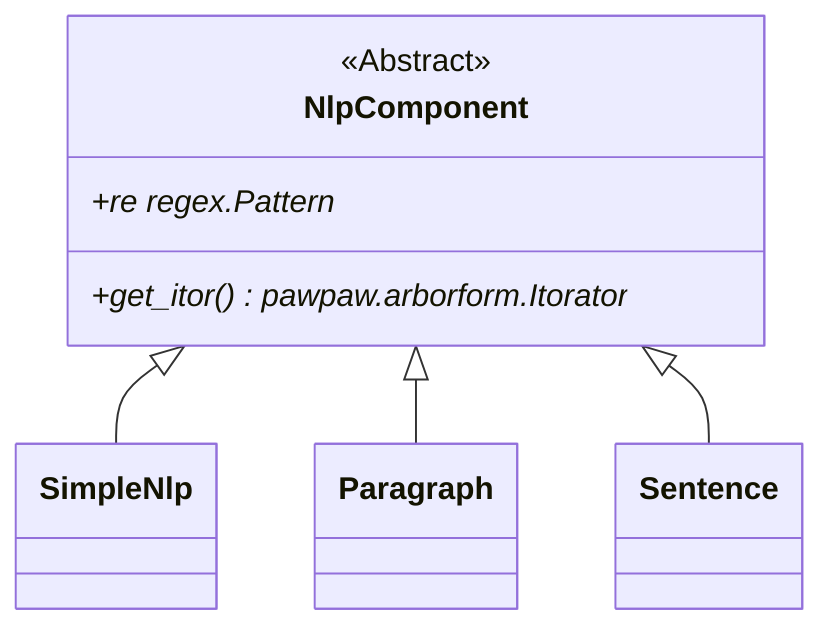

# NLP

## Introduction

Pawpaw is well suited for Natural Language Processing (NLP) software development.  NLP is a deep topic, and it can sometimes be difficult to select which state of the art (SoA) approaches are best suited for your particular data and needs.

The intent of Pawpaw's ``nlp`` module is not serve as a replacement for the excellent work that has been done in this field.  Rather, ``nlp`` is available as a simple and easy to use toolbox that offers an excellent balance of features and performance for English language data.

## Architecture

The ``nlp`` contains a variety of useful lexical data marker collections for Python unicode strings:

* ``byte_order_controls``
* ``unicode_white_space_LF_FF``
* ``unicode_white_space_eol``
* ``unicode_white_space_other``
* ``unicode_single_quote_marks``
* ``unicode_double_quote_marks``
* ``unicode_bullets``

NLP methods are split among a class hierarchy, whose base class is ``NlpComponent``:



The concrete classes ``Paragraph`` and ``Sentence`` are usable independently, or collectively via the ``SimpleNlp``:

```python
>>> import pawpaw
>>> tom_sawyer = '''“Tom!”
... 
... No answer.
... 
... “TOM!”
... 
... No answer.
... 
... “What’s gone with that boy,  I wonder? You TOM!”
... 
... No answer.'''
>>> nlp = pawpaw.nlp.SimpleNlp()
>>> result = nlp.from_text(tom_sawyer)
>>> tree_vis = pawpaw.visualization.pepo.Tree()
>>> print(tree_vis.dumps(result))
(0, 100) 'Document' : '“Tom!”\n\nNo answer.…TOM!”\n\nNo answer.'
├──(0, 6) 'paragraph' : '“Tom!”'
│  └──(0, 6) 'sentence' : '“Tom!”'
│     └──(1, 4) 'word' : 'Tom'
├──(8, 18) 'paragraph' : 'No answer.'
│  └──(8, 18) 'sentence' : 'No answer.'
│     ├──(8, 10) 'word' : 'No'
│     └──(11, 17) 'word' : 'answer'
├──(20, 26) 'paragraph' : '“TOM!”'
│  └──(20, 26) 'sentence' : '“TOM!”'
│     └──(21, 24) 'word' : 'TOM'
├──(28, 38) 'paragraph' : 'No answer.'
│  └──(28, 38) 'sentence' : 'No answer.'
│     ├──(28, 30) 'word' : 'No'
│     └──(31, 37) 'word' : 'answer'
├──(40, 88) 'paragraph' : '“What’s gone with th…I wonder? You TOM!”'
│  ├──(40, 78) 'sentence' : '“What’s gone with that boy,  I wonder?'
│  │  ├──(41, 47) 'word' : 'What’s'
│  │  ├──(48, 52) 'word' : 'gone'
│  │  ├──(53, 57) 'word' : 'with'
│  │  ├──(58, 62) 'word' : 'that'
│  │  ├──(63, 66) 'word' : 'boy'
│  │  ├──(69, 70) 'word' : 'I'
│  │  └──(71, 77) 'word' : 'wonder'
│  └──(79, 88) 'sentence' : 'You TOM!”'
│     ├──(79, 82) 'word' : 'You'
│     └──(83, 86) 'word' : 'TOM'
└──(90, 100) 'paragraph' : 'No answer.'
   └──(90, 100) 'sentence' : 'No answer.'
      ├──(90, 92) 'word' : 'No'
      └──(93, 99) 'word' : 'answer'
```

*More coming soon...*
